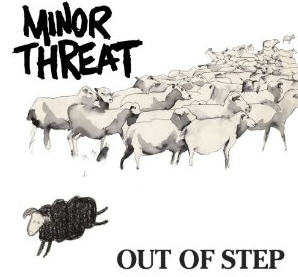

## At a glance

- BDA is about what we *should* believe given:
    - some observable data, and
    - our model of how this data was generated.
- Our best friend will be Bayes rule:
     $$\underbrace{P(\theta \, | \, D)}_{posterior} \propto \underbrace{P(\theta)}_{prior} \times \underbrace{P(D \, | \, \theta)}_{likelihood}$$
- If $P(\theta \, | \, D)$ is hard to compute, we resort to ~~magic~~ some clever stuff.

## Example: coin flips

- $\theta \in [0;1]$ is the bias of a coin:
    - if we throw a coin, the outcome will be heads with probability $\theta$
- we have no clue about $\theta$ at the outset:
    - *a priori* we consider every possible value of $\theta$ equally likely
- we observe that of 24 flips 7 were heads
- what shall we believe about $\theta$ now?

```{r, echo=FALSE, fig.width = 5.5, fig.height = 3, dev.args = list(bg = 'transparent'), fig.align='center'}
  require(ggplot2, quietly = T)
  require(reshape2, quietly = T)
  x = seq(0,1, length.out = 1000)
  prior = dbeta(x, 1, 1)
  posterior = dbeta(x, 8, 18)
  df =data.frame(x = x, prior = prior, posterior = posterior)
  df = melt(df, id.vars = c("x"))
  ggplot(df, aes(x = x, y = value, color = variable)) + geom_line() + xlab("theta") + ylab("our level of credence") + theme(plot.background=element_blank())
```

## "Classical statistics"

- null hypothesis significance testing (NHST)
    - e.g., is the coin fair ($\theta = 0.5$)
- relies on sampling distributions & p-values
    - standard "tests" can have rigid built-in assumptions
    - implicitly rely on experimenter's intentions
- looks at point estimates only

## Pros & Cons of BDA {.columns-2} 

### Pro

- well-founded & totally general
- easily extensible / customizable
- more informative / insightful


### Con

- less ready-made, more hands-on
- not yet fully digested by community
- lacks "standard solutions"



## 3 times Bayes


1. **Bayesian data analysis**
    - "classical" analyses Bayes-style (Kruschke 2015)
2. **Bayesian cognitive modeling**
    - custom models of the data-generating process (Lee & Wagenmakers 2013)
3. **Bayes in the head**
    - model (human) cognition as Bayesian inference


## Goals of this course

- to understand basic ideas of BDA (contrast with NHST)
- to be able to read current literature on BDA
- to be able to implement (simple) Bayesian analyses
    - using R (or some other programming language)
    - using JAGS (or some other ~~magic~~ clever stuff)
- to see how BDA blends seamlessly into cognitive modeling

## Resources

- textbooks:
    - Kruschke (2015) ["Doing Bayesian Data Analysis"](https://sites.google.com/site/doingbayesiandataanalysis/)
    - Lee & Wagenmakers (2014) ["Bayesian Cognitive Modeling"](http://bayesmodels.com)
    - Gelman et al. (2013) ["Bayesian Data Analysis"](http://www.stat.columbia.edu/~gelman/book/)
- selected journal papers
- tools: [R](https://www.r-project.org), [JAGS](http://mcmc-jags.sourceforge.net), [JASP](https://jasp-stats.org)

## Course overview

session | date | topic | reading (main) | homework
:---:|:---:|---|---|---|
1 | 10/14 | course overview & probability primer | Kruschke 4 & 5.1 | |
2 | 10/21 | basics of BDA | Krushke 5 & 6 | |
3 | 10/28 | BDA vs. NHST | Wagenmakers (2007) | |
4 | 11/4  | using R | Kruschke 3 | hw 1 due |
5 | 11/11  | MCMC methods | Kruschke 7 | |
6 | 11/18  | using JAGS | Kruschke 8 | hw 2 due |
7 | 11/25  | generative models | Kruschke 9 |  |
8 | 12/2  | model comparison | Kruschke 10 | hw 3 due |
9 | 12/9  | Bayesian NHST & model criticism | Kruschke 11, 12 |  |
10 | 12/16  | regression models | Kruschke 10 | hw 4 due |

## Credits

for 3 credits you must ...

- hand in all 5 homework sets, and
- finish with a final project, e.g.:
    - take home exam (enough for a Proseminar Schein)
    - a literature survey (enough for a Proseminar Schein)
    - an analysis of your own data set
    - a replication/extension of some other analysis
    - write a discussion paper (e.g., philosophy of BDA)

grade will be a (non-arbitrary) function of homework grades and final project


