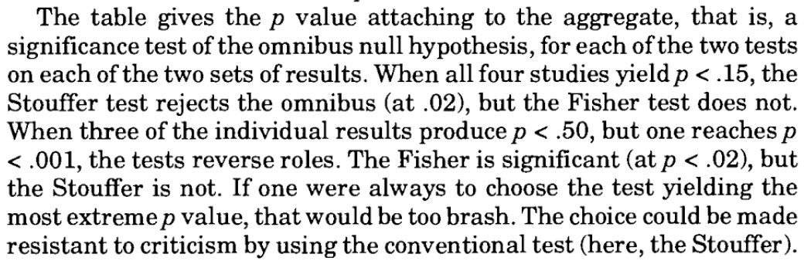

```{r setup, include=FALSE, echo = FALSE, message = FALSE}
knitr::opts_chunk$set(echo=TRUE, warning=FALSE, message=FALSE, dev.args = list(bg = 'transparent'), fig.align='center')
require('ggplot2')
require('reshape2')
require('coda')
require('ggmcmc')
require('rjags')
require('runjags')
require('dplyr')
require('gridExtra')
require('rstan')
theme_set(theme_bw() + theme(plot.background=element_blank()) )
```

## At a glance

<span style = "color:white"> &nbsp; </span>

- BDA is about what we *should* believe given:
    - some observable data, and
    - our model of how this data was generated.
    
<span style = "color:white"> &nbsp; </span>


- Our best friend will be Bayes rule:
     $$\underbrace{P(\theta \, | \, D)}_{posterior} \propto \underbrace{P(\theta)}_{prior} \times \underbrace{P(D \, | \, \theta)}_{likelihood}$$

<span style = "color:white"> &nbsp; </span>

- If $P(\theta \, | \, D)$ is hard to compute, we resort to ~~magic~~ some clever stuff.

## Example: coin flips

- $\theta \in [0;1]$ is the bias of a coin:
    - if we throw a coin, the outcome will be heads with probability $\theta$
- we have no clue about $\theta$ at the outset:
    - *a priori* we consider every possible value of $\theta$ equally likely
- we observe that of 24 flips 7 were heads
- what shall we believe about $\theta$ now?

```{r, echo=FALSE, fig.width = 5.5, fig.height = 3, dev.args = list(bg = 'transparent'), fig.align='center'}
  x = seq(0,1, length.out = 1000)
  prior = dbeta(x, 1, 1)
  posterior = dbeta(x, 8, 18)
  df =data.frame(x = x, prior = prior, posterior = posterior)
  df = melt(df, id.vars = c("x")) %>% rename(belief = variable)
  ggplot(df, aes(x = x, y = value, color = belief)) + geom_line() + xlab("theta") + ylab("our level of credence") + theme(plot.background=element_blank())
```

## "Classic statistics"

<span style = "color:white"> &nbsp; </span>


<div style = "float:left; width:55%;">

- null hypothesis significance testing (NHST)
    - e.g., is the coin fair ($\theta = 0.5$)
    - [tyranny of the discontinuous mind](http://www.newstatesman.com/blogs/the-staggers/2011/12/issue-essay-line-dawkins)
    
<span style = "color:white"> &nbsp; </span>
    
    
- relies on sampling distributions & $p$-values
    - standard "tests" can have rigid built-in assumptions
    - implicitly rely on experimenter's intentions
    
<span style = "color:white"> &nbsp; </span>    
    
- looks at point estimates only

<span style = "color:white"> &nbsp; </span>

- bag of magic tricks
  
</div>
<div style = "float:right; width:35%;">
  
<div align = 'center'>
  

    
</div>
  
</div>  

## Any thoughts?

<span style = "color:white"> &nbsp; </span>
<span style = "color:white"> &nbsp; </span>


<div align = 'center'>
  
</div>

<div style = "position:absolute; top: 620px; right:60px;">
  from Abelson (1995) "Statistics as a Principled Argument"; quote tweeted by Richard D. Morey, April 24 2017
</div>


## Pros & Cons of BDA {.columns-2} 

### Pro

- well-founded & totally general
- easily extensible / customizable
- more informative / insightful
- stimulates view: "models as tools"


### Con

- less ready-made, more hands-on
- not yet fully digested by community
- possibly computationally complex
- requires thinking (wait, that's a pro!)


## 3 times Bayes


<span style = "color:white"> &nbsp; </span>


1. <span style = "color:firebrick">Bayesian statistics</span>
    - Bayesian alternatives to "classic" statistical analyses (e.g., Kruschke 2015)
<span style = "color:white"> &nbsp; </span>
2. <span style = "color:firebrick">Bayesian cognitive modeling</span>
    - custom models of the data-generating process (e.g., Lee & Wagenmakers 2014)
<span style = "color:white"> &nbsp; </span>
3. <span style = "color:firebrick">Bayesian models of cognition</span>
    - model (human) cognition as Bayesian inference (e.g., Goodman & Tenenbaum [2016](https://probmods.org))


## Goals of this course

<span style = "color:white"> &nbsp; </span>

- to understand basic ideas of BDA (contrast with NHST)

<span style = "color:white"> &nbsp; </span>


- to see how BDA blends seamlessly into cognitive modeling

<span style = "color:white"> &nbsp; </span>


- to be able to read current literature on BDA


<span style = "color:white"> &nbsp; </span>

- to implement and evaluate Bayesian analyses


## Credits

<span style = "color:white"> &nbsp; </span>

for 6 credits you must ...

- hand in all homework sets (4 or 5), and
- finish with a final project, e.g.:
    - take home exam (enough for a Proseminar Schein)
    - a literature survey (enough for a Proseminar Schein)
    - an analysis of your own data set
    - a replication/extension of some other analysis
    - write a discussion paper (e.g., philosophy of BDA)

<span style = "color:white"> &nbsp; </span>

grade will be a (non-arbitrary) function of homework grades and final project

## Etiquette

- slides are not self-explanatory -> you must attend class
- one-minded attention during class -> no social media, news or whatever
- come prepared, read around, think along, ask questions
-  recap lesson later the same day:
    - rethink
    - reread
    - take notes
    - prepare questions
- nobody is master; all are fallible; knowledge gain is community work

## Preparation for next class

<span style = "color:white"> &nbsp; </span>

- check the [website](https://michael-franke.github.io/BDACM_2017/) 

- read the notes on [materials](https://michael-franke.github.io/BDACM_2017/notes/01_github.html), [software](https://michael-franke.github.io/BDACM_2017/notes/02_software.html), and [literature](https://michael-franke.github.io/BDACM_2017/notes/03_literature.html)

- install R & RStudio -> play around!

- browse, read or devour [R for Data analysis Science](http://r4ds.had.co.nz)

