```{r setup, include=FALSE, echo = FALSE, message = FALSE}
knitr::opts_chunk$set(echo=TRUE, warning=FALSE, message=FALSE, dev.args = list(bg = 'transparent'), fig.align='center')
require('tidyverse')
theme_set(theme_bw() + theme(plot.background=element_blank()) )
```

## road map for today

<span style = "color:white"> &nbsp; </span>

- get in touch with R for <span style = "color:firebrick">data wrangling & plotting</span>
    - think about data & its format
    - manipulate data into appropriate format: <span style = "color:firebrick">data wrangling</span>
    - extract <span style = "color:firebrick">data summaries</span> 
    - choose aspects to <span style = "color:firebrick">visualize data</span>
    
<span style = "color:white"> &nbsp; </span>

- look at data set from <span style = "color:firebrick">case study</span> on quantifier <span style = "font-style: italic">some</span>

# R for data science

## data science?

<div align = 'center'>
  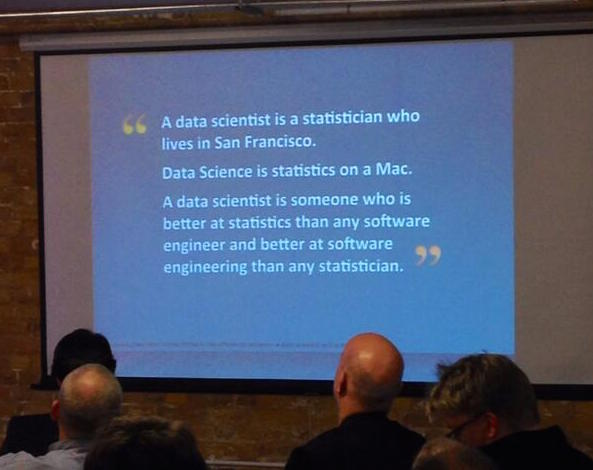
</div>

<div style = "position:absolute; top: 620px; right:60px;">
  read [more](https://priceonomics.com/whats-the-difference-between-data-science-and/)
</div>


## data science?

<span style = "color:white"> &nbsp; </span>

<div align = 'center'>
  
</div>

<div style = "position:absolute; top: 620px; right:60px;">
  from [R for Data Science](http://r4ds.had.co.nz/explore-intro.html)
</div>


# R

## R

<span style = "color:white"> &nbsp; </span>

special purpose programming language ~~data science~~ <span style = "color:firebrick">statistical computing</span>

- statistics
- data mining
- data visualization

<span style = "color:white"> &nbsp; </span>

[authority](https://rviews.rstudio.com/2017/02/22/how-to-teach-r-common-mistakes/) says to tell you: 
<span style = "color:firebrick">do not think of R as a programming language!</span>

## R

<span style = "color:white"> &nbsp; </span>

is a trusted old friend

<span style = "color:white"> &nbsp; </span>

a lot of innovation and development takes place in <span style = "color:firebrick">packages</span>

<span style = "color:white"> &nbsp; </span>

- install packages (only once)

```{r, eval = F}
install.packages('tidyverse')
```


<span style = "color:white"> &nbsp; </span>

- load packages (for every session)

```{r, eval = F}
library(tidyverse)
```


## base R & package functions

<span style = "color:white"> &nbsp; </span>

base R functionality is always available

```{r}
rnorm(n = 5, mean = 10) # 5 samples from a normal with mean 10 & std. dev. 1 (default)
```

<span style = "color:white"> &nbsp; </span>

packages bring extra functions

```{r}
library(mvtnorm)
mvtnorm::rmvnorm(n = 5, mean = rep(10,5)) # 5 samples from a multivariate normal
```

## help

<span style = "color:white"> &nbsp; </span>

```{r}
help('rmvnorm')
```


    Mvnorm {mvtnorm}	R Documentation
    Multivariate Normal Density and Random Deviates

    Description

    These functions provide the density function and a random number generator
    for the multivariate normal distribution with mean equal to mean and 
    covariance matrix sigma.

    Usage

    dmvnorm(x, mean = rep(0, p), sigma = diag(p), log = FALSE)
    rmvnorm(n, mean = rep(0, nrow(sigma)), sigma = diag(length(mean)),
        method=c("eigen", "svd", "chol"), pre0.9_9994 = FALSE)


## RStudio

integrated develop environment for R

<span style = "color:white"> &nbsp; </span>


<div align = 'center'>
  
</div>

# case study

## truth-value judgement task 

<div align = 'center'>
  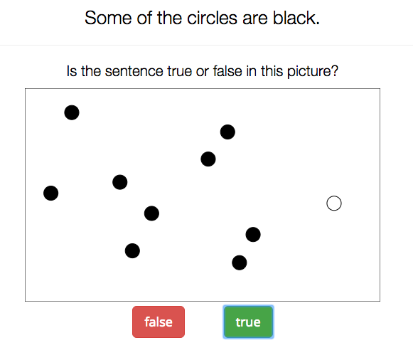
</div>

## test your intuitions

"Some of the circles are black."

<div align = 'left'>
  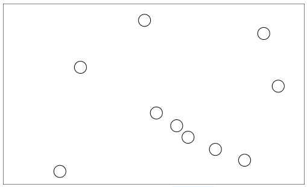
  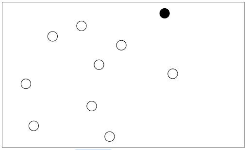
  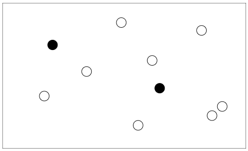
  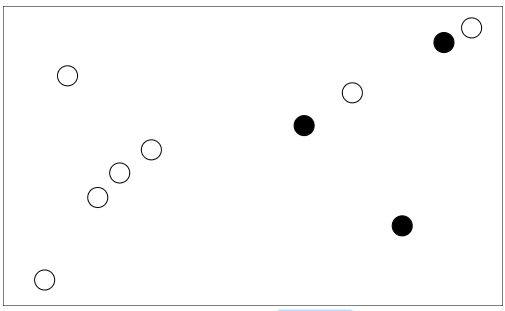
  
  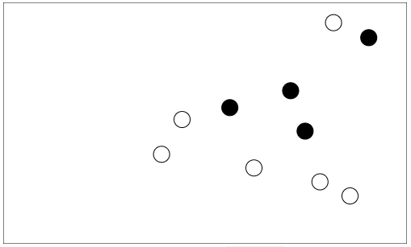
  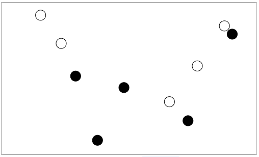
  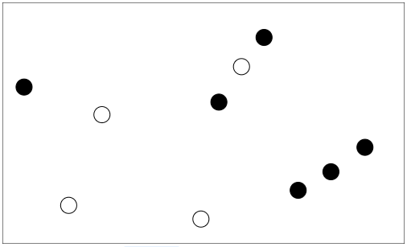
  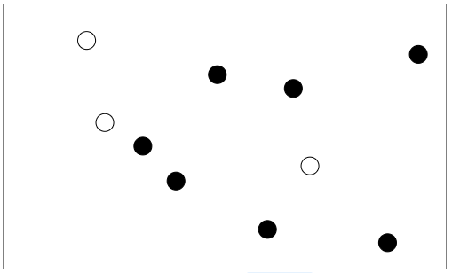
  
  
  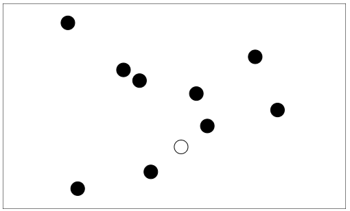
  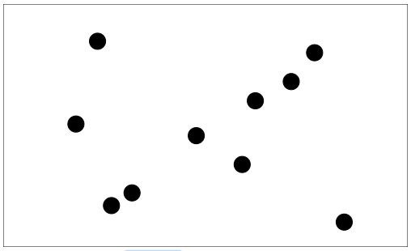
</div>

## rating scale task

<div align = 'center'>
  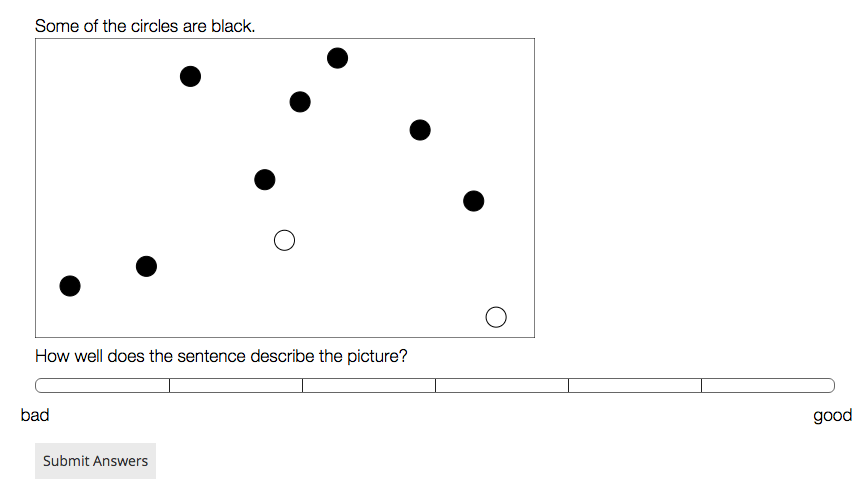
</div>

## design

- replication/extension of previous work
    - van Tiel & Geurts (2014), van Tiel (2014), Degen & Tanenhaus (2015)
- 4 experimental variants:
    - binary truth-value judgements vs. 7-point rating scale
    - include filler sentences with $\textit{many}$ and $\textit{most}$ or not
- participants recruited via Amazon's Mechanical Turk
    - each subject rated 3 sentences with <span style = "font-style: italic">some</span>
    - pseudo-randomized order; fully randomized visual displays


<span style = "color:white"> dummy </span>

<div align = 'center'>
  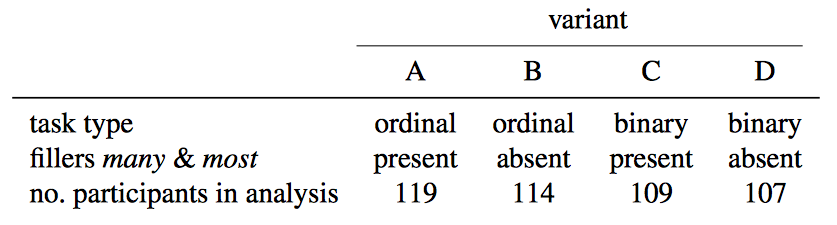
</div>

# data wrangling

## read data

```{r, message = T}
d = readr::read_csv('../data/00_typicality_some.csv') # from package 'readr'
```

## inspect data

```{r}
d
```

## any comments?

```{r}
levels(factor(d$comments))[1:20]
```


## self-reported native languages

```{r}
table(d$language)
```

## filter non-native speakers of Enblush

```{r}
d = dplyr::filter(d, ! language %in% c("FRENCH", "Japanese", "Russian", "Spanish", "Tamil", "white"))
table(d$language)
```


## select relevant columns & rows

```{r}
d = d %>% dplyr::filter(type == "some") %>% 
          dplyr::select(-language, -comments, -type)
d
```

## more intelligible column names

```{r}
d = d %>% dplyr::rename(condition = nr_black)
d
```

## adding columns

```{r}
d = d %>% dplyr::mutate(dependent.measure = ifelse(variant %in% c("A", "B"), "ordinal", "binary"),
                        alternatives = factor(ifelse(variant %in% c("A", "C"), "present", "absent"))) %>% 
          dplyr::select(- variant)
d
```

## rescale responses

```{r}
d = d %>% mutate(response = purrr::map2_dbl(dependent.measure, response, 
                                            function(x,y) { ifelse(x == "ordinal", (y-1)/6, y) } ))
d
```


## get mean RTs for dependent measures

```{r}
d %>% dplyr::group_by(dependent.measure) %>% 
      dplyr::summarize(mean.response = mean(response)) %>% show()
```


## get mean responses

```{r}
resp.summary = d %>% dplyr::group_by(dependent.measure, alternatives, condition) %>% 
                     dplyr::summarize(mean.response = mean(response))
resp.summary
```

# data visualization

## a naked plot

```{r}
ggplot()
```

## plotting mean responses

```{r}
ggplot(data = resp.summary, aes(x = condition, y = mean.response)) +
  geom_point()
```

## plotting mean responses per treatment

```{r}
ggplot(data = resp.summary, aes(x = condition, y = mean.response, color = alternatives)) +
  geom_point()
```

## plotting mean responses per treatment & depentend measure

```{r}
ggplot(data = resp.summary, aes(x = condition, y = mean.response, color = alternatives)) +
  geom_point() + geom_line() + facet_grid( . ~ dependent.measure)
```

## some cosmetics

```{r}
ggplot(data = resp.summary, aes(x = condition, y = mean.response, color = alternatives)) +
  geom_point() + geom_line() + facet_grid( . ~ dependent.measure) + 
  xlab("number of black balls") + ylab("mean response") +
  scale_x_continuous(breaks = 0:10) + scale_color_manual(values = c("darkgrey", "firebrick"))
```

# towards Bayesian modeling

## methodological puzzles

- do binary and ordinal tasks measure the same thing?
    - one is about truth, the other about "goodness"
    - <span style = "color:firebrick">what does it even mean to measure something with a task?</span>
- is what either task measures influenced by presence/absence of alternatives?
    - <span style = "color:firebrick">what is the effect of additional fillers on judgements?</span>
- how would we answer these questions with standard statistical techniques?
    - <span style = "color:firebrick">is there a place for pragmatic theory in a statistical model?</span>

## custom-made data-generating model

<div style = "position:absolute; top: 100px; left:100px;">
  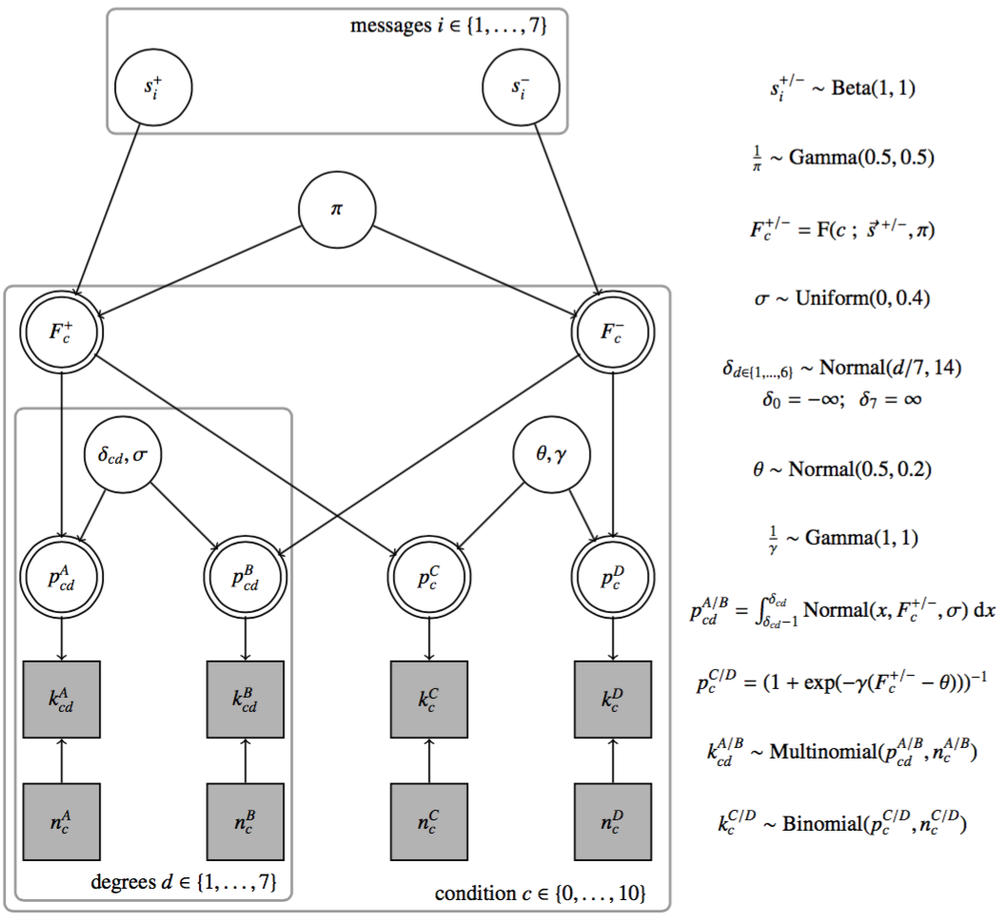
</div>

## results: PPCs for trained model

<div align = 'center'>
  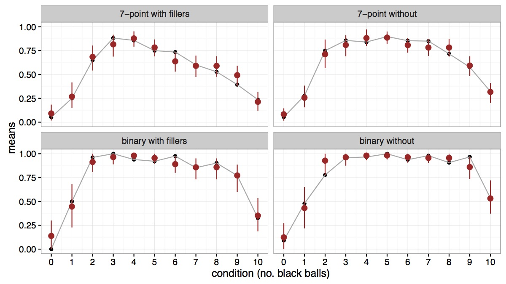
</div>

# fini

## to prevent boredom

<span style = "color:firebrick">obligatory</span>

- prepare Kruschke Chapter 4

- fill in CSV file and send it to [Christian Adam](mailto:christian.adam@uni-tuebingen.de)

<span style = "color:white"> &nbsp; </span>

<span style = "color:firebrick">optional</span>

- read more on [R for Data Science](http://r4ds.had.co.nz)

- explore reading times in today's data set

<span style = "color:white"> &nbsp; </span>

