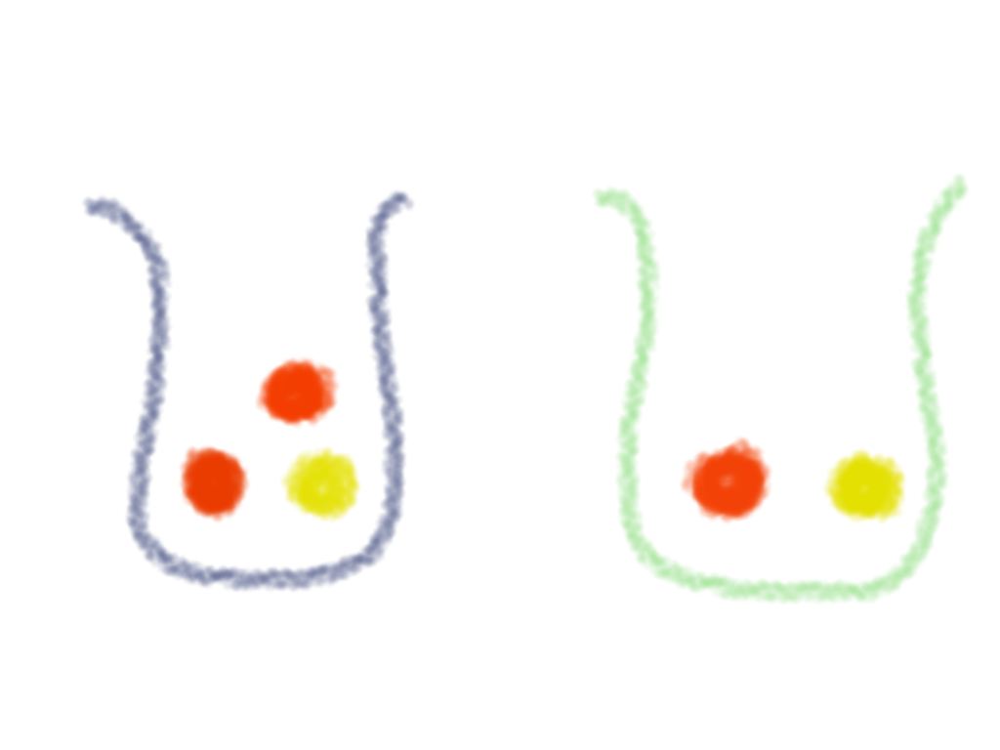
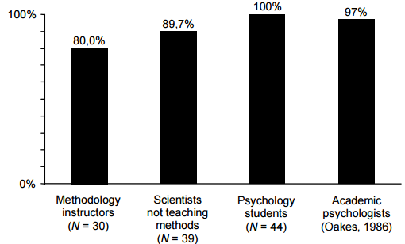

```{r setup, include=FALSE, echo = FALSE, message = FALSE}
knitr::opts_chunk$set(echo=TRUE, warning=FALSE, message=FALSE, dev.args = list(bg = 'transparent'), fig.align='center')
require('tidyverse')
require('forcats')
theme_set(theme_bw() + theme(plot.background=element_blank()) )
```

<script type="text/x-mathjax-config">
  MathJax.Hub.Config({ TeX: { extensions: ["color.js"] }});
</script>

```{r, child = "miincludes.Rmd"}

```


## road map for today

<span style = "color:white"> &nbsp; </span>

- probability
    - discrete, continuous, cumulative
    - subjective vs. objective chance
    - example distributions
    
<span style = "color:white"> &nbsp; </span>

- conditional probability & Bayes rule

<span style = "color:white"> &nbsp; </span>

- $p$-values & confidence intervals

# probability: discrete

## definition

<span style = "color:white"> &nbsp; </span>


a <span style = "color:firebrick">discrete probability distribution</span> over a finite set of mutually exclusive world states $\States$ is a function $P \colon \States \rightarrow [0;1]$ such that $P(\States)=1$.

<span style = "color:white"> &nbsp; </span>

for finite $\States$, $P(\state)$ is $\state$'s <span style = "color:firebrick">probability mass</span>

## example

okay, winter is coming; but who will sit the Iron Throne next spring?

<span style = "color:white"> &nbsp; </span>

```{r}
house.probs = c(6,3,1,2,4) %>% (function(x) x/sum(x))
names(house.probs)= c("Targaryen", "Lannister", "Baratheon", "Greyjoy", "Stark")
round(house.probs,3)
```

<span style = "color:white"> &nbsp; </span>

```{r}
sum(house.probs)
```


## example

```{r, fig.height = 3.5}
house.probs.df = as_tibble(house.probs) %>% 
  mutate(house = names(house.probs) %>% factor() %>% fct_inorder()) %>% 
  rename(probability = value)
house.plot = ggplot(house.probs.df, aes(x = house, y = probability)) + 
  geom_bar(stat = "identity", fill = "firebrick")
house.plot
```

## notation

<span style = "color:white"> &nbsp; </span>

if $f \colon \States \rightarrow \mathbb{R}^{\ge0}$, then

$$ P(\state) \propto f(\state) $$

is shorthand notation for

$$ P(\state) = \frac{f(\state)}{ \sum_{\state' \in \States} f(\state')} $$

<span style = "color:white"> &nbsp; </span>

<span style = "color:firebrick">example</span>

```{r, eval = F}
house.probs = c(6,3,1,2,4) %>% (function(x) x/sum(x))
```


## binomial

the <span style = "color:firebrick">binomial distribution</span> gives the probability of observing $k$ successes in $n$ coin flips with a bias of $p$:

$$ B(k ; n,p) = \binom{n}{k} p^{k} \, (1-p)^{n-k} $$ 

```{r, echo = F, fig.height = 3.5}
binom.plot.data = expand.grid(n = 24, p = c(0.25, 0.5), k = 0:24) %>% 
  mutate(probability = dbinom(k,n,p), p = as.factor(p))
binom.plot = ggplot(binom.plot.data, aes(x = k, y = probability, fill = p)) + 
  geom_bar(stat = "identity", position = "dodge") +
  scale_fill_manual(values = c("darkgrey", "firebrick"))
binom.plot
```

## negative binomial

the <span style = "color:firebrick">negative binomial distribution</span> gives the probability of needing $n$ coin flips to observe $k$ successes with a bias of $p$:

$$ NB(n ; k,p) = \frac{k}{n} \binom{n}{k} p^{k} \, (1-p)^{n - k}$$

```{r, echo = F, fig.height = 3.5}
neg.binom.plot.data = expand.grid(n = 0:75, p = c(0.25, 0.5), k = 7) %>% 
  mutate(probability = k/n * dbinom(k,n,p), p = as.factor(p))
neg.binom.plot = ggplot(neg.binom.plot.data, aes(x = n, y = probability, fill = p)) + 
  geom_bar(stat = "identity", position = "dodge") +
  scale_fill_manual(values = c("darkgrey", "firebrick"))
neg.binom.plot
```

## multinomial

probability of seeing $\tuple{x_1, \dots, x_k}$ in $n$ draws from a discrete probability distribution with $\tuple{p_1, \dots, p_n}$ where $x_i$ is the number of times that category $i$ was drawn ($\sum_{i = 1}^k x_i = n$)

$$ \mathrm{MultiNom}(\tuple{x_1, \dots, x_k} ; \tuple{p_1, \dots, p_n} ) = \frac{n!}{x_1! \dots x_n!} p_1^{x_1} \dots p_n^{x_n} $$

## Poisson

<span style = "color:firebrick">Poisson distribution</span> gives the probability of an event occurring $k$ times in a fixed interval, when the expected value and variance of $k$ is $\lambda$

$$ \mathrm{Poisson}(k ; \lambda) =  \frac{\lambda^k \exp(-\lambda)}{k!}$$ 

```{r, echo = F, fig.height = 3.5}
poisson.plot.data = expand.grid(k = 0:25, lambda = c(4, 10)) %>% 
  mutate(probability = dpois(k,lambda), lambda = as.factor(lambda))
poisson.plot = ggplot(poisson.plot.data, aes(x = k, y = probability, fill = lambda)) + 
  geom_bar(stat = "identity", position = "dodge") +
  scale_fill_manual(values = c("darkgrey", "firebrick"))
poisson.plot
```

## cumulative distribution

$\States$ is <span style = "color:firebrick">ordinal</span> if there is a total strict ordering such that for all $\state, \state' \in \States$:

$$ \state > \state' \ \ \mathrm{or} \ \ \state < \state'$$

the <span style = "color:firebrick">cumulative distribution</span> of $P$ is $P_{\le}(\state) = \sum_{\state' \le \state}P(\state')$

<span style = "color:firebrick">example: cumulative Poisson</span>

```{r, echo = F, fig.height = 3.5}
poisson.plot.data = expand.grid(k = 0:25, lambda = c(4, 10)) %>% 
  mutate(probability = ppois(k,lambda), lambda = as.factor(lambda))
poisson.plot = ggplot(poisson.plot.data, aes(x = k, y = probability, color = lambda)) + 
  geom_point() + geom_line() +
  scale_color_manual(values = c("darkgrey", "firebrick")) + ylab("cumulative probability mass")
poisson.plot
```

# probability: continuous

## definition

<span style = "color:white"> &nbsp; </span>

a <span style = "color:firebrick">probability distribution</span> over an infinite set (a convex, continuous interval) $\States \subseteq \mathbb{R}$ is a function $P \colon \pow{\States} \rightarrow \mathbb{R}^{\ge 0}$ such that $\int P(\state) \mathrm{d}\state = 1$

<span style = "color:white"> &nbsp; </span>

for all intervals $I = [a;b] \subseteq \States$: $\Pr(I) = \int_{a}^{b} f(\state) \ \text{d}\state$
    
<span style = "color:white"> &nbsp; </span>

for infinite $\States$, $P(\state)$ is $\state$'s <span style = "color:firebrick">probability density</span>

## Normal distribution

for mean $\mu$ and standard deviation $\sigma$, the <span style = "color:firebrick">normal distribution</span> is:

$$ \mathcal{N}(x ; \mu, \sigma) = \frac{1}{\sqrt{2 \sigma^2 \pi}} \exp \left ( - \frac{(x-\mu)^2}{2 \sigma^2} \right) $$

<span style = "color:white"> &nbsp; </span>


```{r, echo = F, fig.height = 3}
normal.plot = ggplot(data.frame(x = c(-8, 8)), aes(x = x)) +
  stat_function(fun = function(x) dnorm(x, sd = 4), aes(color = "4")) +
  stat_function(fun = function(x) dnorm(x, sd = 1), aes(color = "1")) +
  scale_colour_manual("standard deviation", breaks = c("4", "1"), values = c("firebrick", "darkgrey")) +
  ylab("Norm(x ; mu = 0, sd")
normal.plot
```

## beta distribution


the <span style = "color:firebrick">beta distribution</span> has a support on the unit interval $[0;1]$ and models a wide variety of shapes for shape parameters $alpha$ and $\beta$

it is the <span style = "color:firebrick">conjugate prior</span> for a binomial model in Bayesian analysis (more soon!)

$$ \text{Beta}(x ; \alpha, \beta) \propto x^{\alpha-1} \, (1-x)^{\beta-1} $$

<span style = "color:white"> &nbsp; </span>


```{r, echo = F, fig.height = 3}
beta.plot = ggplot(data.frame(x = c(0, 1)), aes(x = x)) +
  stat_function(fun = function(x) dbeta(x, shape1 = 1, shape2 = 1),  aes(color = "a=1, b=1")) +
  stat_function(fun = function(x) dbeta(x, shape1 = 4, shape2 = 1),  aes(color = "a=4, b=1")) +
  stat_function(fun = function(x) dbeta(x, shape1 = 5, shape2 = 10), aes(color = "a=5, b=10")) +
  scale_colour_manual("shape parameters", breaks = c("a=1, b=1", "a=4, b=1", "a=5, b=10"), 
                      values = c("firebrick", "darkgrey", "skyblue")) +
  ylab("Beta(x ; a, b)")
beta.plot
```


# interpretations of probability

## objective vs. subjective probability

<span style = "color:white"> &nbsp; </span>

<div style="text-align: center">
  what's your subjective belief about the chance of drawing a red ball?
</div>


<div align = 'center'>
  
</div>

## interpretations of probability

<span style = "color:white"> &nbsp; </span>

<span style = "color:firebrick">objective</span>

- probabilities correspond to limit frequencies
- probability is an inherent property of the outside world

<span style = "color:white"> &nbsp; </span>

<span style = "color:firebrick">subjective</span>

- probabilities are levels of credence of an agent
- they inform (rational) decision making
- beliefs can themselves be rational

<div style = "position:absolute; top: 620px; right:60px;">
  more on this topic in [SEP](https://plato.stanford.edu/entries/probability-interpret/) & an [underground classic](https://www.princeton.edu/~bayesway/Book*.pdf)
</div>


# conditional probability & Bayes rule

## probability logic

<span style = "color:white"> &nbsp; </span>

let $X,Y \subseteq T$ for finite $\States$

<span style = "color:white"> &nbsp; </span>


<div style = "float:left; width:35%;">

<span style = "color:firebrick">axioms</span>

- $P(\emptyset) = 0$
- $P(X) = \sum_{\state \in X} P(\state)$
  
</div>
<div style = "float:right; width:55%;">

<span style = "color:firebrick">corollaries</span>

- $P(X \cup Y) = P(X) + P(Y) - P(X \cap Y)$
- $P(\States \setminus X) = 1 - P(X)$
  
</div>  


<div style = "position:absolute; top: 620px; right:60px;">
  [more](https://plato.stanford.edu/entries/logic-probability/) on probability & logic
</div>

## conditional probability

<span style = "color:white"> &nbsp; </span>


the <span style = "color:firebrick">conditional probability </span> of $X \subseteq \States$ given $Y \subseteq \States$ is:

$$ P(X \mid Y) = \frac{P(X \cap Y)}{P(Y)} $$

<span style = "color:white"> &nbsp; </span>


the <span style = "color:firebrick">conditional probability </span> of $\state$ given $Y \subseteq \States$ is:

$$ P(X \mid Y) = \begin{cases}\frac{P(\state)}{P(Y)} & \mathrm{if } \ \ \state \in Y \\
0 & \mathrm{otherwise}
\end{cases} $$

<div style = "position:absolute; top: 620px; right:60px;">
  requires $P(Y) \neq 0$
</div>


## example

original belief:

```{r}
house.probs
```

updated after learning that it's not a northern house:

```{r}
house.probs.upated = c(house.probs[1:3], 0, 0) %>% (function(x) x / sum(x))
house.probs.upated
```

NB: probability ratios stay intact 

## Bayes rule

<span style = "color:white"> &nbsp; </span>

given probability $P(Y \mid X)$, we derive probability $P(X \mid Y)$:

$$ \begin{align*}
        \red{P(X \mid Y)}\  & \red{\propto P(Y\mid X) \cdot P(X)} \\
        & = \frac{P(Y\mid X) \cdot P(X)}{\sum_{X'} P(Y \mid X') \cdot P(X')} =
        \frac{P(Y\mid X) \cdot P(X)}{P(Y)} = \frac{P(X \cap Y)}{P(Y)}
  \end{align*} $$

<span style = "color:white"> &nbsp; </span>

<span style = "color:firebrick">why useful?</span>

- reasoning from cause to effect ("abduction")
- inferring latent, unobservable stuff (model parameters) from concrete data

# $p$-values and confidence intervals

## wide-spread confusion

many statistical concepts are misunderstood by the majority of researchers

- Oakes (1986): $p$-values are misinterpreted all the time
- Haller & Kraus ([2002](https://www.metheval.uni-jena.de/lehre/0405-ws/evaluationuebung/haller.pdf)): also true for senior researchers and statistics teachers
- Hoekstra et al. (2014): the same holds true for confidence intervals

<div align = 'center'>
  
</div>
    

## quiz

<span style = "color:white"> &nbsp; </span>

1. $p$-values quantify subjective confidence that the null hypothesis is true/false
2. $p$-values quantify objective evidence for/against the null hypothesis
3. $p$-values quantify how surprising the data is under the null hypothsis
4. $p$-values quantify probability that the null hypothesis is true/false
5. non-significant $p$-values mean that the null hypothesis is true
6. significant $p$-values mean that the null hypothesis is false
6. significant $p$-values mean that the null hypothesis is unlikely

<div style = "position:absolute; top: 620px; right:60px;">
  which of these are true?
</div>

## $p$-values


sloppy version: the $p$-value (of a two-sided exact test) gives the probability, under the null hypothesis, of an outcome at least as unlikely as the actual outcome 

better version: the $p$-value is the probability of observing, under <span style = "color:firebrick">infinite hypothetical repetitions of the same experiment</span>, a less extreme value of a <span style = "color:firebrick">test statistic</span> than that of the oberved data, given that the null hypothesis is true


<div align = 'center'>
  
</div>

## example: fair coin?

- we flip $n=24$ times and observe $k = 7$ successes
- null hypothesis: $p = 0.5$

```{r, echo = FALSE, fig.align='center', fig.width=5, fig.height=3}
  
plotData = data.frame(x = 0:24, y = dbinom(0:24, 24, 0.5))
plotData2 = data.frame(x = c(0:7, 17:24), y = dbinom(c(0:7, 17:24), 24, 0.5))
sig.plot = ggplot(plotData, aes(x = x , y = y )) + geom_bar(stat = "identity", fill = "skyblue", width = 0.35) +
  geom_bar(data = plotData2, aes(x = x, y = y), stat = "identity", fill = "darkblue", width = 0.35) +
  geom_hline(yintercept=dbinom(7,24,0.5)) + xlab("k") + ylab("B(k | n = 24, p = 0.5)") +
  # geom_text(data.frame(x = 3, y = 0.05, label = paste0("p = " , round(1-sum(dbinom(8:16, 24, 0.5)),3), collapse = "")), aes(x = x, y = y, label = label)) 
  geom_text(x = 3, y = 0.03, label = paste0("p = " , round(1-sum(dbinom(8:16, 24, 0.5)),3), collapse = ""))
sig.plot
```

## example: fair coin?

```{r}
binom.test(7,24)
```

## significance

fix a significance level, e.g.: $0.05$

<span style = "color:white"> &nbsp; </span>

we say that a test result is significant a $p$-value is below the pre-determined significance level

<span style = "color:white"> &nbsp; </span>

we reject the null hypothesis in case of significant test result

<span style = "color:white"> &nbsp; </span>

the significance level thereby determines the $alpha$-error of falsely rejecting the null hypothesis

- aka: type-I error / incorrect rejection / false positive


## confidence interval

the null hypothesis fixes a concrete value of some parameter (e.g., coin bias $p = 0.5$)

we have an experiment $E$ and we have a set of all possible outcomes $O(E)$ of that experiment

the observed outcome is $o^*$

consider a function $I \colon o \mapsto I_o$ mapping each possible outcome $o \in O(E)$ to an interval of relevant parameter values

this construction is a level-$(1-p)$ <span style = "color:firebrick">confidence interval</span> iff, under the assumption that the null hypothesis is correct, when we repeat the experiment infinitely often, the proportion of intervals $I_{o}$, associated with each outcome $o$ of a hypothetical repetition, that contain the the true parameter value is $1-p$

## great visualization

<span style = "color:white"> &nbsp; </span>

<div style="text-align: center">
  [here](http://rpsychologist.com/d3/CI/)
</div>

## what do we learn from a CI?

<span style = "color:white"> &nbsp; </span>

1. range of values we would not reject (at the given significance level)
2. range of values that would not make the data surprising (at the given level)
3. range of values that are most likely given the data
4. range of values that it is rational to belief in / bet on
5. that the true value lies in this interval
6. that the true value is likely in this interval
7. that, if we repeat the experiment, the outcome will likely lie in this interval


# fini

## outlook

<span style = "color:white"> &nbsp; </span>

<span style = "color:firebrick">Friday</span>

- some oddities of $p$-values & Rmarkdown

<span style = "color:white"> &nbsp; </span>

<span style = "color:firebrick">Tuesday</span>

- introduction to a Bayesian approach to statistical inference

## to prevent boredom

<span style = "color:firebrick">obligatory</span>

- prepare Wagenmakers ([2007](http://www.ejwagenmakers.com/2007/pValueProblems.pdf))
    - only up to page 792 (you may stop at section "A Bayesian test of the $p$ postulate"; you may also go on)

<span style = "color:white"> &nbsp; </span>

<span style = "color:firebrick">optional</span>

- read [R for Data Science](http://r4ds.had.co.nz) part IV on Rmarkdown

<span style = "color:white"> &nbsp; </span>

