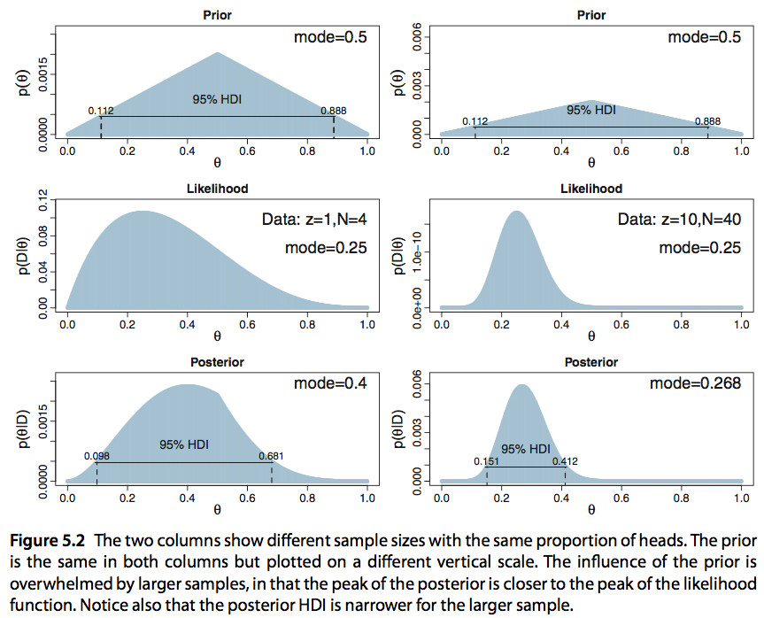
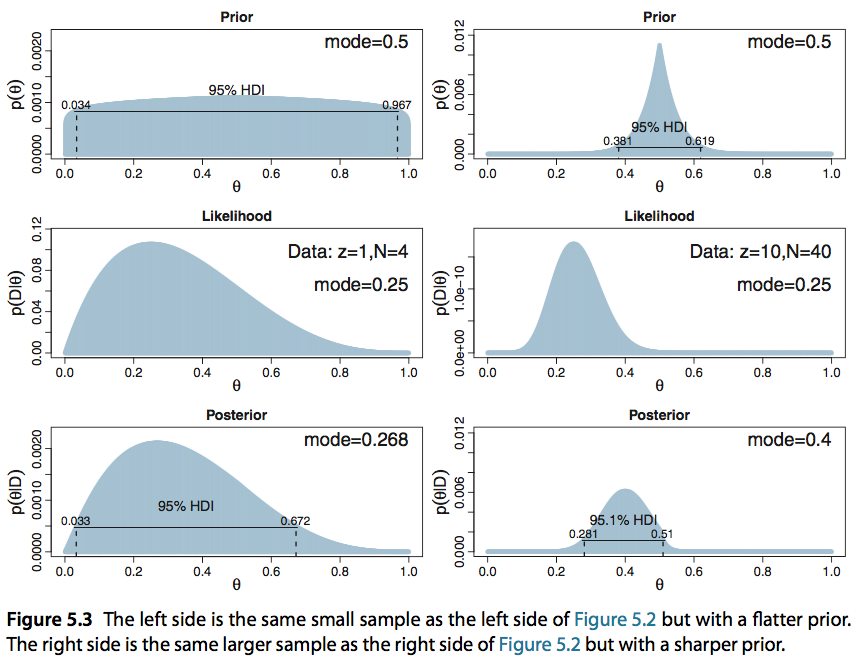
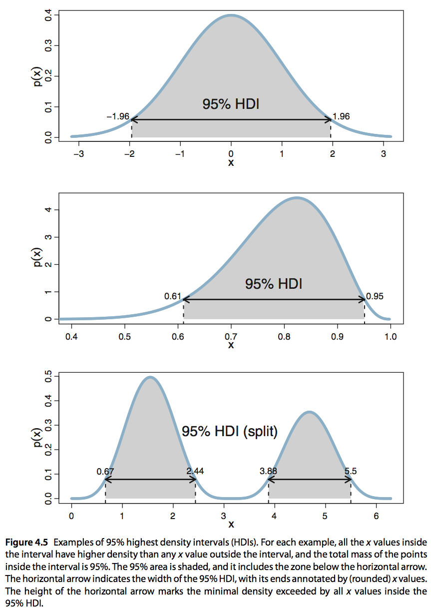
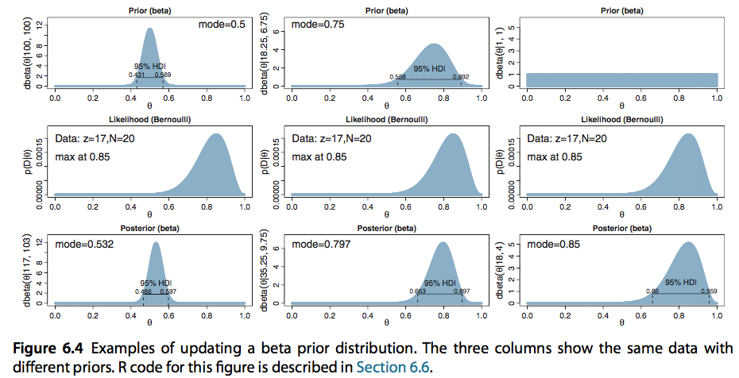

```{r setup, include=FALSE, echo = FALSE, message = FALSE}
knitr::opts_chunk$set(echo=TRUE, warning=FALSE, message=FALSE, dev.args = list(bg = 'transparent'), fig.align='center')
require('tidyverse')
require('forcats')
theme_set(theme_bw() + theme(plot.background=element_blank()) )
```

<script type="text/x-mathjax-config">
  MathJax.Hub.Config({ TeX: { extensions: ["color.js"] }});
</script>

```{r, child = "miincludes.Rmd"}

```


## key notions

- joint distributions & marginalization
- conditional probability & Bayes rule
- 3 pillars of Bayesian data analysis:
    - estimation 
    - comparison
    - prediction
- highest density interval
- conjugate priors


## recap

definition of **conditional probability**:

$$P(X \, | \, Y) = \frac{P(X \cap Y)}{P(Y)}$$

definition of Bayes rule: 

$$P(X \, | \, Y) = \frac{P(Y \, | \, X) \ P(X)}{P(Y)}$$

version for data analysis:

$$\underbrace{P(\theta \, | \, D)}_{posterior} \propto \underbrace{P(\theta)}_{prior} \ \underbrace{P(D \, | \, \theta)}_{likelihood}$$


# Bayes rule in multi-D

## proportions of eye & hair color

<!---
|  | blond | brown | red | black
:---:|:---:|:---:|:---:|:---:|
blue  | 0.03 | 0.09 | 0.04 | 0.04 |
green | 0.09 | 0.02 | 0 | 0.05 |
brown | 0.09 | 0.41 | 0.01 | 0.13 |
--->

joint probability distribution as a two-dimensional matrix:

```{r, echo = FALSE, message = FALSE}
  # require('gtools')
  # x = matrix(rdirichlet(1, rep(1, 12)), nrow = 3)
  prob2ds = matrix(c(0.03, 0.09, 0.04, 0.04, 0.09, 0.02, 0, 0.05, 0.09, 0.41, 0.01, 0.13), nrow = 3)
  rownames(prob2ds) = c("blue", 'green', 'brown')
  colnames(prob2ds) = c("blond", 'brown', 'red', 'black')
```

```{r}
prob2ds
```


marginal distribution over eye color:

```{r}
  rowSums(prob2ds)
```

## proportions of eye & hair color

joint probability distribution as a two-dimensional matrix:

```{r}
prob2ds
```

conditional probability given blue eyes:

```{r}
  round(prob2ds[1,] / sum(prob2ds[1,]), 4)
```

## model & data

- single coin flip with unknown success bias $\theta \in \{0, \frac{1}{3}, \frac{1}{2}, \frac{2}{3}, 1\}$
- flat prior beliefs: $P(\theta) = .2\,, \forall \theta$

<span style = "color:white"> &nbsp; </span>


<div style = "float:left; width:45%;">

model likelihood $P(D \, | \, \theta)$:

```{r echo = FALSE}
  likelihood = round(matrix(c(0, 1, 1/3, 2/3, 1/2, 1/2, 2/3, 1/3, 1, 0), nrow = 2),2)
  rownames(likelihood) = c("heads", 'tails')
  colnames(likelihood) = c("t=0", "t=1/3", "t=1/2", "t=2/3", "t=1")
```


```{r}
  likelihood
```

  
</div>
<div style = "float:right; width:45%;">
  
weighing in $P(\theta)$:

```{r}
  prob2d = likelihood  * 0.2
  prob2d
```

</div>  


<div style = "position:absolute; top: 620px; right:60px;">
  back to start: joint-probability distribution as 2d matrix again
</div>


## model, data & Bayesian inference

Bayes rule: $P(\theta \, | \, D) \propto P(\theta) \times P(D \, | \, \theta)$

```{r}
  prob2d
```

<div style = "float:left; width:45%;">

posterior $P(\theta \, | \, \text{heads})$ after one success:

```{r}
  prob2d[1,]/sum(prob2d[1,])
```

</div>
<div style = "float:right; width:45%;">

```{r, echo = FALSE, fig.width = 4.5, fig.height = 2.75, dev.args = list(bg = 'transparent'), fig.align='center'}
  plotData = data.frame(prior = rep(0.2,5), posterior = prob2d[1,]/sum(prob2d[1,]), theta = c(0, 1/3, 0.5, 2/3, 1))
  plotData = gather(plotData, key = distribution, value = probability, prior, posterior )
  ggplot(plotData, aes(x = theta, y = probability, color = distribution )) + geom_point() + geom_line() + theme(plot.background=element_blank()) + 
    scale_color_manual(values = c("darkgrey", "firebrick"))
```
  
</div>  


# fun with coins

## likelihood function for several tosses

conventions: 

- heads is 1; tails is 0
- pair $\langle n_h, n_t \rangle$ is an outcome with $n_h$ heads, $n_t$ tails
- $n = n_h + n_t$ is the total number of flips


probability of outcome $\langle n_h, n_t \rangle$ is given by the <span style="color:black">binomial distribution</span>:

$$P(\langle n_h, n_t \rangle \, | \, \theta) = {{n}\choose{n_h}} \theta^{n_h} \, (1-\theta)^{n_t}$$ 

```{r}
  binomialMatrix = matrix(0, nrow = 3, ncol = 5)
  colnames(binomialMatrix) = colnames(prob2d)
  rownames(binomialMatrix) = c("(0,2)", "(1,1)", "(2,0)")
  thetas = c(0, 1/3, 0.5, 2/3, 1)
  ks = 0:2
  for (theta in 1:length(thetas)){
    for (k in 1:length(ks)){
      binomialMatrix[k,theta] = dbinom(ks[k],2,thetas[theta])
    }
  }
  show(round(binomialMatrix,2))
```


## excursion: Kruschke's approach

conventions:

- heads is 1; tails is 0
- outcomes are arbitrary sequences of flip results, e.g.: $1001$
- each flip result is assumed to be independent

probability of flip sequence with $n_h$ heads and $n_t$ tails is given by the <span style="color:black">"Kruschke-Bernoulli distribution"</span>:

$$P(\langle n_h, n_t \rangle \, | \, \theta) = \theta^{n_h} \, (1-\theta)^{n_t}$$ 

e.g., likelihood function for all flip sequences of at most length 2:

```{r}
  KruschkeMatrix = matrix(0, nrow = 6, ncol = 5)
  colnames(KruschkeMatrix) = colnames(prob2d)
  rownames(KruschkeMatrix) = c("0", "1", "00", "01", "10", "11")
  KruschkeMatrix[1:2,] = likelihood[2:1,]
  thetas = c(0, 1/3, 0.5, 2/3, 1)
  outcomes = c(0,1,1,2)
  for (theta in 1:length(thetas)){
    for (outcome in 1:length(outcomes)){
      KruschkeMatrix[outcome+2,theta] = thetas[theta]^outcomes[outcome] * (1-thetas[theta])^(2- outcomes[outcome])
    }
  }
  show(round(KruschkeMatrix,2))
```

## influence of sample size on posterior

<div class = "centered">

</div>

## influence of prior on posterior

<div class = "centered">

</div>

# highest density intervals

## highest density interval

Given a distribution $P(x)$ over $X$, the <span style = "color:black">95% highest density interval</span> is a subset $Y \subseteq X$ such that:

1. $P(Y) = .95$, and
2. no point outside of $Y$ is more likely than any point within.

<span style = "color:white"> dummy </span>

Intuition: range of values we are justified to belief in (categorically).

## examples

<div class = "centered">

</div>


# welcome infinity

## continuous biases

what if $\theta$ is allowed to have any value $\theta \in [0;1]$?

(at least) two problems:

1. how to specify $P(\theta)$ in a concise way?
2. how to compute normalizing constant $\int_0^1 P(D \, | \, \theta) \times P(\theta) \, \text{d}\theta$ in Bayes rule?

<span style = "color:white">dummy</span>

<div class = "columns-2">

one solution:
  
  - use <span style = "color:black">beta distribution</span> to specify prior $P(\theta)$ with some handy parameters
  - since this is the <span style = "color:black">conjugate prior</span> to our likelihood function, computing posteriors is as easy as sleep

<span style = "color:white"> dummy </span>

<span style = "color:white"> dummy </span>
  

</div>

## beta distribution

2 shape parameters $a, b > 0$, defined over domain $[0;1]$

$$\text{Beta}(x \, | \, a, b) \propto x^{a-1} \, (1-x)^{b-1}$$

<div class = "centered">

</div>

## conjugate distributions

If the prior $P(\theta)$ and the posterior $P(\theta \, | \, D)$ are probability distributions of the same family, they are called conjugate; in particular, the posterior is then the <span style = "color:black">conjugate prior</span> for the likelihood function $P(D \, | \, \theta)$ from which the posterior $P(\theta \, | \, D)$ is derived.

<span style = "color:black">NTS:</span> The beta distribution is the conjugate prior of Kruschke's likelihood function.

Unravel definitions & rewrite:

$$ \begin{align*} 
P(\theta \, | \, \langle n_h, n_t \rangle) & \propto P(\langle n_h, n_t \rangle \, | \, \theta) \, \text{Beta}(\theta \, | \, a, b) \\
& \propto \theta^{n_h} \, (1-\theta)^{n_t} \, \theta^{a-1} \, (1-\theta)^{b-1} \\
& = \theta^{n_h + a -1} \, (1-\theta)^{n_t +b -1} 
\end{align*}  $$

Hence, by definition:

$$ P(\theta \, | \, \langle n_h, n_t \rangle) =  \text{Beta}(\theta \, | \, n_h + a, n_t + b)$$

## example applications

<div class = "centered">

</div>

# the road ahead

## bda more generally

problems:

- conjugate priors are not always available:
    - likelihood functions can come from unbending beasts:
        - complex hierarchical models (e.g., regression)
        - custom-made stuff (e.g., probabilistic grammars)
- even when available, they may not be what we want:
    - prior beliefs could be different from what a conjugate prior can capture

<span style = "color:white"> dummy </span>
    
solution:

- approximate posterior distribution by smart numerical simulations


# fini

## outlook

<span style = "color:white"> &nbsp; </span>

<span style = "color:firebrick">Tuesday</span>

- introduction to MCMC methods

<span style = "color:white"> &nbsp; </span>

<span style = "color:firebrick">Friday</span>

- introduction to JAGS


## to prevent boredom

<span style = "color:white"> &nbsp; </span>

<span style = "color:firebrick">obligatory</span>

- prepare Kruschke chapter 7 

- finish first homework set: due Friday before class