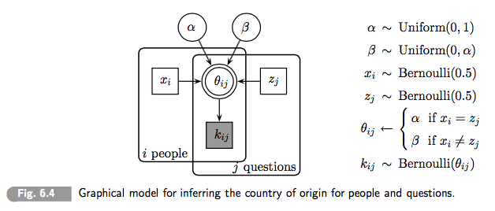

```{r setup, include=FALSE, echo = FALSE, message = FALSE}
knitr::opts_chunk$set(echo=TRUE, warning=FALSE, message=FALSE, 
                      dev.args = list(bg = 'transparent'), fig.align='center',
                      cache=TRUE)
require('tidyverse')
require('forcats')
require('rjags')
require('ggmcmc')
show = function(x) { x }
theme_set(theme_bw() + theme(plot.background=element_blank()) )
```

<script type="text/x-mathjax-config">
  MathJax.Hub.Config({ TeX: { extensions: ["color.js"] }});
</script>

<script type="text/x-mathjax-config">
MathJax.Hub.Register.StartupHook("TeX Jax Ready",function () {
  var MML = MathJax.ElementJax.mml,
      TEX = MathJax.InputJax.TeX;

  TEX.Definitions.macros.bfrac = "myBevelFraction";

  TEX.Parse.Augment({
    myBevelFraction: function (name) {
      var num = this.ParseArg(name),
          den = this.ParseArg(name);
      this.Push(MML.mfrac(num,den).With({bevelled: true}));
    }
  });
});
</script>


```{r, child = "miincludes.Rmd"}

```


## recap

Bayes rule for data analysis:

$$\underbrace{P(\theta \, | \, D)}_{posterior} \propto \underbrace{P(\theta)}_{prior} \times \underbrace{P(D \, | \, \theta)}_{likelihood}$$

Markov Chain Monte Carlo

- sequence of representative samples from $X \sim P$ 

JAGS

- declarative language to specify <span style = "color:firebrick">data-generating model</span>
    - model = prior + likelihood function
    - samples of whatever variable we want:
        - conditioning on data $\rightarrow$ additional constraints on log-score
        
        
        
## plan for today

- fun with JAGS models
    - hierarchical models / latent mixture models
    - think: "data-generating process"
    - ideas & notation
- priors in hierarchical models
- shrinkage
- examples, examples, examples


# first example

## example (recap)

```{r, results='hide', warning=FALSE, message=FALSE}
require('rjags')
modelString = "
model{
  theta ~ dbeta(1,1)
  k ~ dbinom(theta, N)
}"
# prepare for JAGS
dataList = list(k = 7, N = 24)
# set up and run model
jagsModel = jags.model(file = textConnection(modelString), 
                       data = dataList,
                       n.chains = 2)
update(jagsModel, n.iter = 5000)
codaSamples = coda.samples(jagsModel, 
                           variable.names = c("theta"),
                           n.iter = 5000)
```


## example (recap)

```{r, fig.align='center', fig.width=7, fig.height=3.5}
ms = ggs(codaSamples)
ggs_density(ms) + 
  stat_function(fun = function(x) dbeta(x, 8,18), color = "black") 
```

## simple scenario

- rational Bayesian agent 
- originally believes $\theta \sim Beta(1,1)$ (any bias equally likely)
- observes $k = 7$ successes in $N = 24$ tosses

<span style = "color:white"> &nbsp; </span>


<div style = "float:left; width:45%;">

```{r, eval = FALSE}
model{
  theta ~ dbeta(1,1)
  k ~ dbinom(theta, N)
}
```
   
  
</div>
<div style = "float:right; width:45%;">

```{r, results='hide', warning=FALSE, message=FALSE, echo = FALSE, fig.height = 3, fig.width = 4}
ggplot(data.frame(x = c(0,1)), aes(x)) +
 stat_function(fun = function(x) dbeta(x,1,1), aes(color = "prior")) +
 stat_function(fun = function(x) dbeta(x,8,18), aes(color = "posterior")) +
 scale_colour_manual("", breaks = c("prior", "posterior"), values = c("firebrick", "darkgray"))
```

</div>  


## slightly more complex scenario

- rational Bayesian agent 
- originally believes $\theta \sim Beta(16,16)$ 
    - e.g., has observed 15 successes and 15 failures
    - has updated believes via Bayes rule
- observes another $k = 7$ successes in $N = 24$ tosses


<div style = "float:left; width:45%;">

```{r, eval = FALSE}
model{
  theta ~ dbeta(6,16)
  k ~ dbinom(theta, N)
}
```

</div>
<div style = "float:right; width:45%;">

```{r, results='hide', warning=FALSE, message=FALSE, echo = FALSE, fig.height = 3, fig.width = 4}
ggplot(data.frame(x = c(0,1)), aes(x)) +
 stat_function(fun = function(x) dbeta(x,6,16), aes(color = "prior")) +
 stat_function(fun = function(x) dbeta(x,13,33), aes(color = "posterior")) +
 scale_colour_manual("", breaks = c("prior", "posterior"), values = c("firebrick", "darkgray"))
```

</div>  


## complex scenario

- <span style = "color:firebrick">boundedly-rational</span>, Bayesian agent with <span style = "color:firebrick">imprecise memory</span>
- has observed 15 successes and 15 failures but doesn't clearly remember
- observes another $k = 7$ successes in $N = 24$ tosses

<span style = "color:white"> &nbsp; </span>

<div style = "float:left; width:45%;">

```{r, eval = FALSE}
model{
  a ~ pois(5)
  b ~ pois(15)
  theta ~ dbeta(a+1,b+1)
  k ~ dbinom(theta, N)
}
```


</div>
<div style = "float:right; width:45%;">

```{r, results='hide', warning=FALSE, message=FALSE, echo = FALSE, fig.height = 3, fig.width = 4}
modelString = "
model{
  a ~ dpois(5)
  b ~ dpois(15)
  theta_prior ~ dbeta(a+1,b+1)
  theta_post ~ dbeta(a+1,b+1)
  k ~ dbinom(theta_post, N)
}"
# prepare for JAGS
dataList = list(k = 7, N = 24)
# set up and run model
jagsModel = jags.model(file = textConnection(modelString), 
                       data = dataList,
                       n.chains = 2)
update(jagsModel, n.iter = 10000)
codaSamples = coda.samples(jagsModel, 
                           variable.names = c("theta_prior", "theta_post"),
                           n.iter = 10000)
ms = ggs(codaSamples)
show(ggs_density(ms))
```

</div>  


# hierarchical models

## graph notation

<div style = "float:left; width:45%;">

```{r, eval = FALSE}
model{
  theta ~ dbeta(1,1)
  k ~ dbinom(theta, N)
}
```

<span style = "color:white"> &nbsp; </span>

<span style = "color:white"> &nbsp; </span>


  
</div>
<div style = "float:right; width:45%;">

<div align = 'center'>

</div>


<span style = "color:white"> &nbsp; </span>

<span style = "color:white"> &nbsp; </span>

</div>  


 


<div style = "float:left; width:44%;">

```{r, eval = FALSE}
model{
  a ~ pois(5)
  b ~ pois(15)
  theta ~ dbeta(a+1,b+1)
  k ~ dbinom(theta, N)
}
```

  
</div>
<div style = "float:right; width:55%;">

<div align = 'center'>

</div>

</div>  


## hierarchical models

- latent variables can depend on other latent variables
- likelihood can be a (direct) function of only some latent variables

<span style = "color:white"> dummy </span>

$$
\begin{align*}
P(\theta, a, b \, | \, D) & \propto P(\theta, a, b) \ P(D \, | \, \theta, a, b)\\
  & = P(a) \ P(b) \ P(\theta \mid a, b) \ P(D \, | \, \theta)
\end{align*}
$$

<span style = "color:white"> dummy </span>
<span style = "color:white"> dummy </span>

<div align = 'center'>

</div>

## deterministic dependencies

<div align = 'center'>

</div>

$$
\begin{align*}
P(\theta, s \, | \, D) & \propto P(\theta, s) \ P(D \, | \, \theta, s)\\
  & = P(s) \ \underbrace{P(\theta \mid s)}_{\text{degenerate!}} \ P(D \, | \, \theta)
\end{align*}
$$


```{r, eval = FALSE}
model{
  s ~ dbern(0.5)
  theta = ifelse(s == 1, 0.75, 0.25)
  k ~ dbinom(theta, N)
}
```

## graph conventions

- type of variable:
    - continuous: circle
    - discrete: square
- information status:
    - observed: grey shade
    - latent: white
- dependency:
    - stochastic: single line
    - deterministic: double line


<div style = "position:absolute; top: 620px; right:60px;">
  Lee & Wagenmakers (2013)
</div>


## the sky is the limit!

<div style = "float:left; width:45%;">
  
<span style = "color:firebrick">from a previous lecture</span>

<div align = 'center'>

</div>  
  
</div>
<div style = "float:right; width:45%;">
  
<span style = "color:firebrick">from Lee & Wagenmakers</span>
  
<div align = 'center'>

</div>  
  
</div>  

# priors in hierarchical models

## priors in hierarchical models

- priors are complex objects
- should make sense at every level in the hierarchy:
    - check dependent priors of intermediate latent variables!
- can have interesting effects
    - e.g., shrinkage (later in this class)

## example

```{r, eval = FALSE}
model{
  b ~ dgamma(1,1)
  a ~ dgamma(1,1)
  theta ~ dbeta(a,b)
  k ~ dbinom(theta, N)
}
```


<span style = "color:white"> dummy </span>
<span style = "color:white"> dummy </span>

<div align = 'center'>

</div>

## example: (hyper-)priors

```{r}
  ggplot(data.frame(x = c(0.0001,10)), aes(x)) +
         stat_function(fun = function(x) dgamma(x,1,1))
```


## example: posteriors

```{r, results='hide', warning=FALSE, message=FALSE, echo = FALSE}
modelString = "
model{
  b ~ dgamma(0.1,0.1)
  a ~ dgamma(0.1,0.1)
  theta ~ dbeta(a,b)
  k ~ dbinom(theta, N)
}"
# prepare for JAGS
dataList = list(k = 7, N = 24)
# set up and run model
jagsModel = jags.model(file = textConnection(modelString), 
                       data = dataList,
                       n.chains = 2)
update(jagsModel, n.iter = 10000)
codaSamples = coda.samples(jagsModel, 
                           variable.names = c("theta", "a", "b"),
                           n.iter = 10000)
ms = ggs(codaSamples)
show(ggs_density(ms))
```

## example: priors

```{r, results='hide', warning=FALSE, message=FALSE, echo = FALSE}
modelString = "
model{
  b ~ dgamma(1,1)
  a ~ dgamma(1,1)
  theta ~ dbeta(a,b)
  # k ~ dbinom(theta, N)
}"
# prepare for JAGS
dataList = list(k = 7, N = 24)
# set up and run model
jagsModel = jags.model(file = textConnection(modelString), 
                       data = dataList,
                       n.chains = 2)
update(jagsModel, n.iter = 50)
codaSamples = coda.samples(jagsModel, 
                           variable.names = c("theta", "a", "b"),
                           n.iter = 15000)
ms = ggs(codaSamples)
ggs_density(ms)
```

## reparameterization

- $\text{Beta}(a,b)$ has mode $\omega$ and concentration $\kappa$:
$$
\begin{align*}
  \omega & = \frac{a-1}{a+b-2} & \kappa &= a + b
\end{align*}
$$
- reformulate:
$$
\begin{align*}
  a & = \omega(\kappa - 2) + 1 & b & = (1-\omega)(\kappa-2)+1
\end{align*}
$$

## reparameterized model

```{r, eval = FALSE}
model{
  omega ~ dbeta(1,1)
  kappaMin2 ~ dgamma(0.01,0.01)
  theta ~ dbeta(omega*kappaMin2+1, 
                (1-omega)*kappaMin2+1)
  k ~ dbinom(theta, N)
  kappa = kappaMin2+2
}
```


<span style = "color:white"> dummy </span>
<span style = "color:white"> dummy </span>

<div align = 'center'>

</div>

## reparameterized model: priors

```{r, results='hide', warning=FALSE, message=FALSE, echo = FALSE}
modelString = "
model{
  omega ~ dbeta(1,1)
  kappaMin2 ~ dgamma(0.01,0.01)
  theta ~ dbeta(omega*kappaMin2+1, 
               (1-omega)*kappaMin2+1)
  # k ~ dbinom(theta, N)
  kappa = kappaMin2+2
}"
# prepare for JAGS
dataList = list(k = 7, N = 24)
# set up and run model
jagsModel = jags.model(file = textConnection(modelString), 
                       data = dataList,
                       n.chains = 2)
update(jagsModel, n.iter = 50)
codaSamples = coda.samples(jagsModel, 
                           variable.names = c("omega", "kappa", "theta"),
                           n.iter = 10000)
ms = ggs(codaSamples)
ggs_density(ms)
```


## reparameterized model: posteriors

```{r, results='hide', warning=FALSE, message=FALSE, echo = FALSE}
modelString = "
model{
  omega ~ dbeta(1,1)
  kappaMin2 ~ dgamma(0.01,0.01)
  theta ~ dbeta(omega*kappaMin2+1, 
               (1-omega)*kappaMin2+1)
  k ~ dbinom(theta, N)
  kappa = kappaMin2+2
}"
# prepare for JAGS
dataList = list(k = 7, N = 24)
# set up and run model
jagsModel = jags.model(file = textConnection(modelString), 
                       data = dataList,
                       n.chains = 2)
update(jagsModel, n.iter = 5000)
codaSamples = coda.samples(jagsModel, 
                           variable.names = c("theta", "omega", "kappa"),
                           n.iter = 5000)
ms = ggs(codaSamples)
show(ggs_density(ms))
```

# latent mixture models

## latent mixtures

- hierarchical models with latent parameters:
    - individual-level differences
    - item-level differences
    - ...
    

<div style = "position:absolute; top: 620px; right:60px;">
  think: mixed effects regression; 
</div>
    
    
## therapeutic touches

<div align = 'center'>

</div>


<span style = "color:white"> dummy </span>
<span style = "color:white"> dummy </span>

- TT practitioners sense energy fields
- they sense which hand is near another persons body


<div style = "position:absolute; top: 620px; right:60px;">
  (Kruschke, chapter 9.2.4)
</div>


## TT data

```{r}
TTdata = readr::read_csv('../data/02_therapeutic_touchers.csv') %>% 
         group_by(s) %>% 
         summarize(k = sum(y), N = length(y))
# k - number of successes per subject
# N - number of trials per subject
head(TTdata)
```

## TTdata

```{r, fig.align='center', fig.width=8, fig.height=4.5}
ggplot(TTdata, aes(x  = s, y = k/N)) + geom_bar(stat='identity')
```


## latent mixture model


<div style = "float:left; width:55%;">
  
```{r, eval = FALSE}
model{
  omega ~ dbeta(1,1)
  kappaMin2 ~ dgamma(0.01,0.01)
  for (i in 1:28){
    theta[i] ~ dbeta(omega*kappaMin2+1, 
                (1-omega)*kappaMin2+1)
    k[i] ~ dbinom(theta[i], N[i])
  }
}
```
  
  
</div>
<div style = "float:right; width:44%;">

<div align = 'center'>

</div>
  
</div>  


## posterior traceplot

```{r, results='hide', warning=FALSE, message=FALSE, echo = FALSE}
modelString = "
model{
  omega ~ dbeta(1,1)
  kappaMin2 ~ dgamma(0.01,0.01)
  kappa = kappaMin2+2
  for (i in 1:28){
    theta[i] ~ dbeta(omega*kappaMin2+1, 
                (1-omega)*kappaMin2+1)
    k[i] ~ dbinom(theta[i], N[i])
  }
}"
# prepare for JAGS
dataList = as.list(TTdata)
# set up and run model
jagsModel = jags.model(file = textConnection(modelString), 
                       data = dataList,
                       n.chains = 2)
update(jagsModel, n.iter = 15000)
codaSamples = coda.samples(jagsModel, 
                           variable.names = c("theta","omega", "kappa"),
                           n.iter = 15000)
ms = ggs(codaSamples)
ggs_traceplot(ms, family = "omega|kappa")
```

## posterior density

```{r}
ggs_density(ms, family = "omega|kappa")
```

## posterior on subject-level guessing bias

```{r, fig.align='center', fig.width=7, fig.height=3.75}
msTheta = filter(ms, ! Parameter %in% c("omega", "kappa"))
msTheta$subject = with(msTheta,
                       factor(regmatches(Parameter, regexpr("[0-9]+", Parameter)), 
                              levels = 1:28))  
ggplot(msTheta, aes(x = subject, y = value)) + geom_boxplot() + ylab("bias level (posterior)")
```

# shrinkage

## what's going on?

```{r, fig.align='center', fig.width=7, fig.height=2.8, echo = FALSE}

ggplot(msTheta, aes(x = subject, y = value)) +geom_boxplot() 

ggplot(TTdata, aes(x = s, y = k/N)) + geom_bar(stat='identity')

```

## shrinkage vs. population-level generalization

- careful: "shrinkage" is a misleading term!
    - shrinkage of variance in low-level parameters (compared to non-hierarchical)
    - variance can also increase, depending on the particular model
- hierarchical modeling "binds together" low-level parameters
    - this is an additional assumption (can be good or bad)
- hierarchical "binding" reduces "freedom" of free variables
    - can guard us against overfitting
- hierarchical group-level binding gives us population-level estimates
    - generalize to new observations

# double mixture classifier

## two country quiz

```{r, echo = FALSE}
k <- c(1,0,0,1,1,0,0,1,
      1,0,0,1,1,0,0,1,
      0,1,1,0,0,1,0,0,
      0,1,1,0,0,1,1,0,
      1,0,0,1,1,0,0,1,
      0,0,0,1,1,0,0,1,
      0,1,0,0,0,1,1,0,
      0,1,1,1,0,1,1,0)
CountryQuizData = matrix(k, nrow=8, byrow=T)
colnames(CountryQuizData) = paste0("Q", c("A", "B", "C", "D", "E", "F", "G", "H"))
rownames(CountryQuizData) = paste0("P", 1:8)
```

Candidates from Thailand and Moldovia take part in a quiz. Questions are about the history of each country. Here's the data of who got which question right.

<span style = "color:white"> &nbsp; </span>


<div style = "float:left; width:45%;">

```{r}
show(CountryQuizData)
```


<span style = "color:white"> &nbsp; </span>

  
</div>
<div style = "float:right; width:45%;">

We want to infer:

1. which questions are (likely) about the history of the same country, and
2. which candidates are (likely) from the same country.

<span style = "color:white"> &nbsp; </span>

</div>  


<div style = "position:absolute; top: 620px; right:60px;">
Lee & Wagenmakers (2013, Chapter 6.4)
</div>


## double mixture model

<div align = 'center'>

</div>

## double mixture model

```{r, eval = FALSE}
model{
  alpha ~ dunif(0,1)    # chance correct if origin matches question
  beta ~ dunif(0,alpha) # mismatch   
  for (i in 1:dim(k)[1]){
    x[i] ~ dbern(0.5)
  }
  for (j in 1:dim(k)[2]){
    z[j] ~ dbern(0.5)
  }   
  for (i in 1:nx){
    for (j in 1:nz){
      theta[i,j] = ifelse(x[i] == z[i], alpha, beta)
      k[i,j] ~ dbern(theta[i,j])
    }
  }   
}
```

<div style = "position:absolute; top: 620px; right:60px;">
  NB: simple for JAGS but a [hard nut for Stan](https://github.com/stan-dev/example-models/blob/master/Bayesian_Cognitive_Modeling/ParameterEstimation/LatentMixtures/TwoCountryQuiz_Stan.R) `r emo::ji(":(")`
</div>


## samples from prior

```{r, results = 'hide', echo = FALSE, fig.align='center', fig.width=7, fig.height=2.5}
modelString = "
model{
  alpha ~ dunif(0,1)    # chance correct if origin matches question
  beta ~ dunif(0,alpha) # mismatch   
  for (i in 1:8) {
    x[i] ~ dbern(0.5)
  }
  for (j in 1:8){
    z[j] ~ dbern(0.5)
  }   
  for (i in 1:8){
    for (j in 1:8){
      theta[i,j] = ifelse(x[i] == z[i], alpha, beta)
      # k[i,j] ~ dbern(theta[i,j])
    }
  }   
}
"
dataList = list(k = CountryQuizData)
# set up and run model
jagsModel = jags.model(file = textConnection(modelString), 
                       data = dataList,
                       n.chains = 2)
update(jagsModel, n.iter = 150)
codaSamples = coda.samples(jagsModel, 
                           variable.names = c("theta", "alpha", "beta"),
                           n.iter = 5000)
ms = ggs(codaSamples)
qplot(x= as.vector(codaSamples[[1]][,"alpha"]), y = as.vector(codaSamples[[1]][,"beta"])) + 
  geom_point() + xlab("alpha") + ylab("beta")
theta = filter(ms, Parameter == "theta[1,1]")$value
qplot(x = theta) + geom_histogram()
```

## posteriors

```{r, results = 'hide', echo = FALSE, , fig.align='center', fig.width=7, fig.height=3.5}
modelString = "
model{
  alpha ~ dunif(0,1)    # chance correct if origin matches question
  beta ~ dunif(0,alpha) # mismatch   
  for (i in 1:8) {
    x[i] ~ dbern(0.5)
  }
  for (j in 1:8){
    z[j] ~ dbern(0.5)
  }   
  for (i in 1:8){
    for (j in 1:8){
      theta[i,j] = ifelse(x[i] == z[j], alpha, beta)
      k[i,j] ~ dbern(theta[i,j])
    }
  }   
}
"
dataList = list(k = CountryQuizData)
# set up and run model
jagsModel = jags.model(file = textConnection(modelString), 
                       data = dataList,
                       n.chains = 2)
update(jagsModel, n.iter = 5000)
codaSamples = coda.samples(jagsModel, 
                           variable.names = c("x","z", "alpha", "beta"),
                           n.iter = 5000)
ms = ggs(codaSamples)
show(qplot(x= as.vector(codaSamples[[1]][,"alpha"]), y = as.vector(codaSamples[[1]][,"beta"])) + 
   geom_point() + xlab("alpha") + ylab("beta") )
# msX = filter(ms, substr(x = Parameter, start = 1, stop = 1) %in% c('z')) %>%
#     mutate(candidate = factor(regmatches(Parameter, regexpr("[0-9]+", Parameter)), 
#                               levels = 1:8)       )
# ggplot(msX, aes(x = candidate, fill = factor(value))) + geom_bar()
```

## posterior over types

<div style = "float:left; width:45%;">

```{r, echo = FALSE}
postTypes = ms %>% group_by(Parameter) %>% summarize(mean = mean(value))
postTypes[1:10,] 
```
  
</div>
<div style = "float:right; width:45%;">

```{r, echo = FALSE}
postTypes[11:18,]
```

  
</div>  


# fini

## summary

- hierarchical models: chains of dependencies btw. variables
- information from data percolates "upward":
    - stronger impact on nearby nodes
    - less impact on higher nodes (convergence checks!)
- high-level nodes can unify estimates for lower-level variables
    - sometimes called "shrinkage"
    - better conceived as: group-level prior homogeneity assumption
- complex data generating models:
    - prior + likelihood
    - our assumptions about how the data could have been generated

# fini

## outlook

<span style = "color:white"> &nbsp; </span>

<span style = "color:firebrick">Friday</span>

- boot camp on complex models in JAGS

<span style = "color:white"> &nbsp; </span>

<span style = "color:firebrick">Tuesday</span>

- model comparison


## to prevent boredom

<span style = "color:white"> &nbsp; </span>

<span style = "color:firebrick">obligatory</span>

- skim Lee & Wagenmakers chapters 5 & 6
    - decide what you want to explor in class
- finish homework 3
