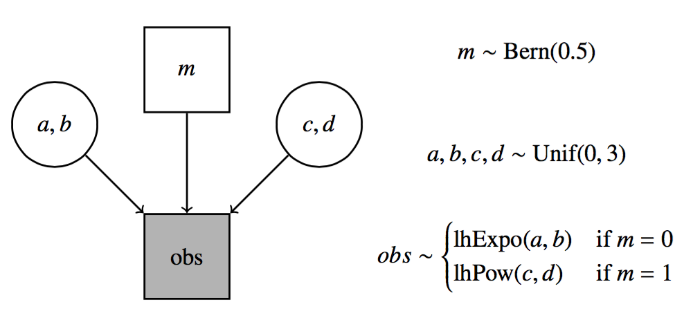

```{r setup, include=FALSE, echo = FALSE, message = FALSE}
knitr::opts_chunk$set(echo=TRUE, warning=FALSE, message=FALSE, 
                      dev.args = list(bg = 'transparent'), fig.align='center',
                      cache=TRUE)
require('tidyverse')
require('forcats')
require('rjags')
require('ggmcmc')
require('reshape2')
require('runjags')
require('dplyr')
require('gridExtra')
show = function(x) { x }
theme_set(theme_bw() + theme(plot.background=element_blank()) )
```

<script type="text/x-mathjax-config">
  MathJax.Hub.Config({ TeX: { extensions: ["color.js"] }});
</script>

<script type="text/x-mathjax-config">
MathJax.Hub.Register.StartupHook("TeX Jax Ready",function () {
  var MML = MathJax.ElementJax.mml,
      TEX = MathJax.InputJax.TeX;

  TEX.Definitions.macros.bfrac = "myBevelFraction";

  TEX.Parse.Augment({
    myBevelFraction: function (name) {
      var num = this.ParseArg(name),
          den = this.ParseArg(name);
      this.Push(MML.mfrac(num,den).With({bevelled: true}));
    }
  });
});
</script>


```{r, child = "miincludes.Rmd"}

```


# recap

## (Bayesian) model comparison

which of two models is more likely, given the data?

$$\underbrace{\frac{P(M_1 \mid D)}{P(M_2 \mid D)}}_{\text{posterior odds}} = \underbrace{\frac{P(D \mid M_1)}{P(D \mid M_2)}}_{\text{Bayes factor}} \ \underbrace{\frac{P(M_1)}{P(M_2)}}_{\text{prior odds}}$$

## summary

|    | standard | Bayes | 
|:---|:---:|:---:|
| today's focus | Akaike's information criterion | Bayes factor
| what counts as model to be compared? | likelihood function $P(D \mid \theta)$ | likelihood $P(D \mid \theta)$ + prior $P(\theta)$
| from which point of view do we compare models? | <span style = "font-style: italic">ex post</span>: after seeing the data | <span style = "font-style: italic">ex ante</span>: before seeing the data
| how to penalize model complexity? | count number of free parameters | implicitly weigh how effective a parameter is
| are we guaranteed to select the true model in the end? | no | yes
| hard to compute? | relatively easy | relatively hard

## roadmap for today

- Bayes factor computation
    - exact computation
    - Savage-Dickey method (recap)
    - grid approximation
    - Monte Carlo simulation
        - naive
        - importance sampling
    - transdimensional MCMC

# Savage Dickey method

## example: model comparison for coin flip data

- observed: $k = 7$ out of $N = 24$ coin flips were successes
- goal: compare a null-model $M_0$ with an alternative model $M_1$
    - $M_0$ has $\theta = 0.5$ and $k \sim \text{Binomial}(0.5, N)$
    - $M_1$ has $\theta \sim \text{Beta}(1,1)$ and $k \sim \text{Binomial}(\theta, N)$
    
    
<span style = "color:white"> &nbsp; </span>
<span style = "color:white"> &nbsp; </span>
    
    
```{r, echo = FALSE, results='hide', warning=FALSE, message=FALSE, fig.align='center', fig.width=6, fig.height=3}
plotData = data.frame(theta = seq(0.01,1, by = 0.01),
                      posterior = dbeta(seq(0.01,1, by = 0.01), 8, 18 ),
                      prior = dbeta(seq(0.01,1, by = 0.01), 1, 1))
plotData = melt(plotData, measure.vars = c("posterior", "prior")) %>% 
  rename(distribution = variable)
pointData = data.frame(x = c(0.5,0.5), y = c(dbeta(0.5,8,18),1))

ggplot(plotData, aes(x = theta, y = value, color = distribution)) + xlim(0,1) + geom_line() + ylab("probability")

```

## exact calculation

- data: $k = 7$ successes in $N = 24$ trials

$$
\begin{align*}
\text{BF}(M_0 > M_1) & = \frac{P(D \mid M_0)}{P(D \mid M_1)} \\
  & = \frac{\text{Binomial}(k,N,0.5)}{\int_0^1 \text{Beta}(\theta, 1, 1) \ \text{Binomial}(k,N, \theta) \text{ d}\theta} \\
  & = \frac{\binom{N}{k} 0.5^{k} \, (1-0.5)^{N - k}}{\int_0^1 \binom{N}{k} \theta^{k} \, (1-\theta)^{N - k} \text{ d}\theta} \\
  & = \frac{\binom{N}{k} 0.5^{N}}{\binom{N}{k} \int_0^1  \theta^{k} \, (1-\theta)^{N - k} \text{ d}\theta} \\
  & = \frac{0.5^{N}}{BetaFunction(k+1, N-k+1)} \approx `r round(0.5^7 * 0.5^(24-7) / beta(8, 25-7),3)`
\end{align*}
$$

## exact calculation (cont.)

unraveling beta function

$$
\begin{align*}
BetaFunction(k+1, N-k+1) & = \frac{\Gamma(k+1) \Gamma(N-k+1)}{\Gamma(N+2)} \\
 & = \frac{(k)! (N-k)!}{(N+1)!} \\
 & = \frac{(k)! (N-k)!}{(N)!} \frac{1}{N+1} \\
 & = \frac{1}{\binom{N}{k}} \frac{1}{N+1} \\
\end{align*}
$$

so:

$$
\begin{align*}
\text{BF}(M_0 > M_1) & = \frac{P(D \mid M_0)}{P(D \mid M_1)} \\
  & = \frac{0.5^{N}}{BetaFunction(k+1, N-k+1)}  \\
  & = \binom{N}{k} 0.5^{N} (N + 1) \approx `r round(0.5^7 * 0.5^(24-7) / beta(8, 25-7),3)`
\end{align*}
$$

## properly nested models

- suppose that ther are $n$ continuous parameters of interest $\theta = \langle \theta_1, \dots, \theta_n \rangle$
- $M_1$ is a model defined by $P(\theta \mid M_1)$ & $P(D \mid \theta, M_1)$
- $M_0$ is <span style = "color:firebrick">properly nested</span> under $M_1$ if:
    - $M_0$ assigns fixed values to parameters $\theta_i = x_i, \dots, \theta_n = x_n$
    - $\lim_{\theta_i \rightarrow x_i, \dots, \theta_n \rightarrow x_n} P(\theta_1, \dots, \theta_{i-1} \mid \theta_i, \dots, \theta_n, M_1) = P(\theta_1, \dots, \theta_{i-1} \mid M_0)$
    - $P(D \mid \theta_1, \dots, \theta_{i-1}, M_0) = P(D \mid \theta_1, \dots, \theta_{i-1}, \theta_i = x_i, \dots, \theta_n = x_n, M_1)$

    
## Savage-Dickey method

let $M_0$ be <span style = "color:firebrick">properly nested</span> under $M_1$ s.t. $M_0$ fixes $\theta_i = x_i, \dots, \theta_n = x_n$

$$
\begin{align*}
\text{BF}(M_0 > M_1) & = \frac{P(D \mid M_0)}{P(D \mid M_1)} \\
  & = \frac{P(\theta_i = x_i, \dots, \theta_n = x_n \mid D, M_1)}{P(\theta_i = x_i, \dots, \theta_n = x_n \mid M_1)}
\end{align*}
$$

```{r, echo = FALSE, results='hide', warning=FALSE, message=FALSE, fig.align='center', fig.width=6, fig.height=3}
plotData = data.frame(theta = seq(0.01,1, by = 0.01),
                      posterior = dbeta(seq(0.01,1, by = 0.01), 8, 18 ),
                      prior = dbeta(seq(0.01,1, by = 0.01), 1, 1))
plotData = melt(plotData, measure.vars = c("posterior", "prior")) %>% 
  rename(distribution = variable)
pointData = data.frame(x = c(0.5,0.5), y = c(dbeta(0.5,8,18),1))


ggplot(plotData, aes(x = theta, y = value, color = distribution)) + xlim(0,1) + geom_line() + ylab("probability") +
  geom_segment(aes(x = 0.52, y = 0, xend = 0.52, yend = 1), color = "darkgray") +
  geom_segment(aes(x = 0.48, y = 0, xend = 0.48, yend = dbeta(0.5,8,18)), color = "darkgray") +
  geom_segment(aes(x = 0.5, y = 1, xend = 0.52, yend = 1), color = "darkgray") +
  geom_segment(aes(x = 0.5, y = dbeta(0.5,8,18), xend = 0.48, yend = dbeta(0.5,8,18)), color = "darkgray") +
  annotate("point", x = 0.5, y = 1, color = "black") +
  annotate("point", x = 0.5, y = dbeta(0.5,8,18), color = "black") + 
  annotate("text", x = 0.3, y = 0.25, color = "darkgray", label = "P(0.5 | D, M1) = 0.516", size = 3) +
  annotate("text", x = 0.68, y = 0.75, color = "darkgray", label = "P(0.5 | M1) = 1", size = 3)

```


## proof

- $M_0$ has parameters $\theta = \tuple{\phi, \psi}$ with $\phi = \phi_0$
- $M_1$ has parameters $\theta = \tuple{\phi, \psi}$ with $\phi$ free to vary
- <span style = "color:firebrick">crucial assumption</span>: $\lim_{\phi \rightarrow \phi_0} P(\psi \mid \phi, M_1) = P(\psi \mid M_0)$
- rewrite marginal likelihood under $M_0$: 

$$ \begin{align*}
P(D \mid M_0) & = \int P(D \mid \psi, M_0) P(\psi \mid M_0) \ \text{d}\psi \\
 & = \int P(D \mid \psi, \phi = \phi_0, M_1) P(\psi \mid \phi = \phi_0, M_1)  \ \text{d}\psi\\
 & = P(D \mid \phi = \phi_0, M_1) \ \ \ \ \ \ \text{(by Bayes rule)} \\
 & = \frac{P(\phi = \phi_0 \mid D, M_1) P(D \mid M_1)}{P(\phi = \phi_0 \mid M_1)}
\end{align*} $$


# memory models

## forgetting data

- subjects each where asked to remember items (Murdoch 1961)
- recall rates `y` for 100 trials after time `t` in seconds

```{r}
y = c(.94, .77, .40, .26, .24, .16)
t = c(  1,   3,   6,   9,  12,  18)
obs = y*100
```


<div style = "position:absolute; top: 620px; right:60px;">
example from Myung (2007), JoMP, tutorial on MLE  
</div>


## forgetting models

recall probabilities for different times $t$


<div style = "float:left; width:45%;">
<span style = "color:firebrick">
exponential model
</span>

$$P(t \ ; \ a, b) = a \exp (-bt)$$ 

$$\text{where } a,b>0 $$

```{r, echo = FALSE, fig.align='center', fig.width=4, fig.height=3}
forgetData = data.frame(t = t, obs = obs, y = y)
myCols = c("firebrick", "coral", "darkgreen")
expo = function(x, c, d) return( c* exp(-x*d) )
power = function(x, a, b) return( a*x^(-b) )
forgetPlotExpo = ggplot(data.frame(x = c(1,20)), aes(x)) +
         stat_function(fun = function(x) expo(x, 1,1), aes(color = "a,b=1")) +
         stat_function(fun = function(x) expo(x, 2,2), aes(color = "a,b=2")) +
         stat_function(fun = function(x) expo(x, 1,0.2), aes(color = "a=1,b=0.1")) +
         scale_colour_manual("Function", breaks = c("a,b=1", "a,b=2", "a=1,b=0.1"), values = myCols) +
          ggtitle("exponential") + geom_point(data = forgetData, aes(x = t, y = y))
show(forgetPlotExpo)
```


## model specification (priors & likelihood function)

<div style = "float:left; width:45%;">
<span style = "color:firebrick">
exponential
</span>

```{r}
priorExp = function(a, b){
  dunif(a, 0, 1.5) * dunif(b, 0, 1.5)
}
lhExp = function(a, b){
  p = a*exp(-b*t)
  p[p <= 0.0] = 1.0e-5
  p[p >= 1.0] = 1-1.0e-5
  prod(dbinom(x = obs, prob = p, size = 100))
}
```

</div>
<div style = "float:right; width:45%;">
<span style = "color:firebrick">
power
</span>

```{r}
priorPow = function(c, d){
  dunif(c, 0, 1.5) * dunif(d, 0, 1.5)
}
lhPow = function(c, d){
  p = c*t^(-d)
  p[p <= 0.0] = 1.0e-5
  p[p >= 1.0] = 1-1.0e-5
  prod(dbinom(x = obs, prob = p, size = 100))
}
```

</div>


# grid approximation

## grid approximation

- consider discrete values for $\theta$
- compute evidence in terms of them
- works well for low-dimensional $\theta$

## example

```{r}

lhExp = Vectorize(lhExp)
lhPow = Vectorize(lhPow)

stepsize = 0.01
evidence = expand.grid(x = seq(0.005, 1.495, by = stepsize),
                       y = seq(0.005, 1.495, by = stepsize)) %>% 
  mutate(lhExp = lhExp(x,y), priExp = 1 / length(x),  # uniform priors!
         lhPow = lhPow(x,y), priPow = 1 / length(x))

paste0("BF in favor of exponential model: ", 
            with(evidence, sum(priExp*lhExp)/ sum(priPow*lhPow)) %>% round(2))
```

overwhelming evidence in favor of the exponential model

# naive Monte Carlo simulation

## recap: why simulate?

generally:

$$\int f(\theta) \ P(\theta) \ \text{d}\theta \approx \frac{1}{n} \sum^{n}_{\theta_i \sim P(\theta)} f(\theta)$$

in particular: 

$$P(D) = \int P(D \mid \theta) \ P(\theta) \ \text{d}\theta \approx \frac{1}{n} \sum^{n}_{\theta_i \sim P(\theta)} P(D \mid \theta)$$

## example: naive sampling

```{r, fig.align='center', fig.width=7, fig.height=3.5, eval = TRUE}
nSamples = 200000
a = runif(nSamples, 0, 1.5)
b = runif(nSamples, 0, 1.5)
lhExpVec = lhExp(a,b)
lhPowVec = lhPow(a,b)
paste0("BF in favor of exponential model: ", 
            sum(lhExpVec)/ sum(lhPowVec) %>% round(2))

```

## time course of estimate

```{r, fig.align='center', fig.width=7, fig.height=3.5, eval = TRUE}
BFVec = sapply(seq(10000,nSamples, by = 200), 
     function(i) sum(lhExpVec[1:i]) / sum(lhPowVec[1:i]))
ggplot(data.frame(i = seq(10000,nSamples, by = 200), BF = BFVec), aes(x=i, y=BF)) +
  geom_line() + geom_hline(yintercept = 1221, color = "firebrick") + xlab("number of samples")
```

# importance sampling

## importance sampling

take an arbitrary function $h(\theta)$ such that $\int h(\theta) \text{d}\theta = 1$

$$
\begin{align*}
\frac{1}{P(D)} & = \frac{P(\theta \mid D)}{P(D \mid \theta) P(\theta)}\\
& = \frac{P(\theta \mid D)}{P(D \mid \theta) P(\theta)} \int h(\theta) \text{d}\theta  \\
& = \int \frac{h(\theta) P(\theta \mid D)}{P(D \mid \theta) P(\theta)}  \text{d}\theta \\
  & \approx \frac{1}{n} \sum^{n}_{\theta_i \sim P(\theta \mid D)} \frac{h(\theta)}{P(D \mid \theta) P(\theta)}
\end{align*}
$$

choose a $h(\theta)$ that resembles the posterior

## JAGS model

```{r, eval = FALSE}
model{
  m ~ dbern(0.5)
  a ~ dunif(0,1.5)
  b ~ dunif(0,1.5)
  c ~ dunif(0,1.5)
  d ~ dunif(0,1.5)
  for (i in 1: 6){
    pT[i] = ifelse(m == 0, a*exp(-t[i]*b), c*t[i]^(-d))
    p[i] = min(max( pT[i], 0.0001), 0.9999)
    obs[i] ~ dbinom(p[i], 100)
  }
}
```


## posterior over parameters for exponential model

```{r, results='hide', warning=FALSE, message=FALSE, echo = TRUE}
modelString = "
model{
  a ~ dunif(0,1.5)
  b ~ dunif(0,1.5)
  for (i in 1: 6){
    pT[i] = a*exp(-t[i]*b)
    p[i] = min(max( pT[i], 0.00001), 0.99999)
    obs[i] ~ dbinom(p[i], 100)
  }
}"
# prepare for JAGS
dataList = list(obs = obs, t = t)
# set up and run model
jagsModel = jags.model(file = textConnection(modelString), 
                       data = dataList,
                       n.chains = 2)
update(jagsModel, n.iter = 25000)
codaSamples = coda.samples(jagsModel, 
                           variable.names = c("a", "b"),
                           n.iter = 5000)
ms = ggs(codaSamples)
```

## parametric approximation for posteriors

```{r, fig.align = 'center', fig.width=4, fig.height=3}
getGammaApprox = function(samples){
  s = sd(samples)
  m = mean(samples)
  ra = ( m + sqrt( m^2 + 4*s^2 ) ) / ( 2 * s^2 )
  sh = 1 + m * ra
  return(c(shape = sh, rate = ra))
}
wideSamples = dcast(ms, Iteration + Chain ~ Parameter)
paramA = getGammaApprox(filter(ms, Parameter == "a")$value)
paramB = getGammaApprox(filter(ms, Parameter == "b")$value)
```

<div style = "float:left; width:45%;">
```{r, fig.align = 'center', fig.width=4, fig.height=3, echo = FALSE}
ggs_density(ms, family = "a") + stat_function(fun = function(x) 
  dgamma(x, rate = paramA["rate"], shape = paramA["shape"]), color = "black") 
```
</div>

<div style = "float:right; width:45%;">
```{r, fig.align = 'center', fig.width=4, fig.height=3, echo = FALSE}
ggs_density(ms, family = "b") + stat_function(fun = function(x) 
  dgamma(x, rate = paramB["rate"], shape = paramB["shape"]), color = "black") 
```
</div>

## parameter estimation for power model

```{r, results='hide', warning=FALSE, message=FALSE, echo = FALSE}
modelString = "
model{
  c ~ dunif(0,1.5)
  d ~ dunif(0,1.5)
  for (i in 1: 6){
    pT[i] = c*t[i]^(-d)
    p[i] = min(max( pT[i], 0.00001), 0.99999)
    obs[i] ~ dbinom(p[i], 100)
  }
}"
# prepare for JAGS
dataList = list(obs = obs, t = t)
# set up and run model
jagsModel = jags.model(file = textConnection(modelString), 
                       data = dataList,
                       n.chains = 2)
update(jagsModel, n.iter = 25000)
codaSamples = coda.samples(jagsModel, 
                           variable.names = c("c", "d"),
                           n.iter = 5000)
ms = ggs(codaSamples)
```

<div style = "float:left; width:45%;">
```{r, fig.align = 'center', fig.width=4, fig.height=3, echo = FALSE}
paramC = getGammaApprox(filter(ms, Parameter == "c")$value)
ggs_density(ms, family = "c") + stat_function(fun = function(x) 
  dgamma(x, rate = paramC["rate"], shape = paramC["shape"]), color = "black") 
```
</div>
<div style = "float:right; width:45%;">
```{r, fig.align = 'center', fig.width=4, fig.height=3, echo = FALSE}
paramD = getGammaApprox(filter(ms, Parameter == "d")$value)
ggs_density(ms, family = "d") + stat_function(fun = function(x) 
  dgamma(x, rate = paramD["rate"], shape = paramD["shape"]), color = "black") 
```
</div>

## summary of estimated parameters

```{r, echo = FALSE}
params = data.frame(parameter = c("a", "b", "c", "d"),
           shape = c(paramA["shape"], paramB["shape"], paramC["shape"], paramD["shape"]),
           rate = c(paramA["rate"], paramB["rate"], paramC["rate"], paramD["rate"]))
show(params)
```


## implement these posterior approximations

<div style="text-align: center">
  homework!
</div>


# transcendental MCMC

## idea

make model index a parameter

<span style = "color:white"> dummy </span>
<span style = "color:white"> dummy </span>

<div align = 'center'>

</div>

## JAGS model

```{r, eval = FALSE}
model{
  m ~ dbern(0.5)
  a ~ dunif(0,1.5)
  b ~ dunif(0,1.5)
  c ~ dunif(0,1.5)
  d ~ dunif(0,1.5)
  for (i in 1: 6){
    pT[i] = ifelse(m == 0, a*exp(-t[i]*b), c*t[i]^(-d))
    p[i] = min(max( pT[i], 0.0001), 0.9999)
    obs[i] ~ dbinom(p[i], 100)
  }
}
```


## posteriors


```{r, results='hide', warning=FALSE, message=FALSE, echo = FALSE}
modelString = "
model{
  m ~ dbern(0.5)
  a ~ dunif(0,1.5)
  b ~ dunif(0,1.5)
  c ~ dunif(0,1.5)
  d ~ dunif(0,1.5)
  for (i in 1: 6){
    pT[i] = ifelse(m == 0, a*exp(-t[i]*b), c*t[i]^(-d))
    p[i] = min(max( pT[i], 0.0001), 0.9999)
    obs[i] ~ dbinom(p[i], 100)
  }
}"
# prepare for JAGS
dataList = list(obs = obs, t = t)
# set up and run model
jagsModel = jags.model(file = textConnection(modelString), 
                       data = dataList,
                       n.chains = 2)
update(jagsModel, n.iter = 50000)
codaSamples = coda.samples(jagsModel, 
                           variable.names = c("m", "a", "b", "c", "d"),
                           n.iter = 5000)
ms = ggs(codaSamples)
wideSamples = dcast(ms, Iteration + Chain ~ Parameter)
```


```{r, echo = FALSE, fig.align='center', fig.width=4, fig.height=2.5}
postM = ggplot(data.frame(m = factor(c(0,1,wideSamples$m), levels = c(0,1))), aes(x = m)) + geom_bar()
show(postM)
```


<div style = "float:left; width:45%;">
```{r, echo = FALSE, fig.align='center', fig.width=4, fig.height=2.5}
expSamples = melt(filter(wideSamples, m == 0), measure.vars = c("a", "b"), id.vars = "Iteration")
postAB = ggplot(expSamples, aes(x = value)) + geom_density() + facet_wrap(~ variable, nrow = 2, scales = "free")
show(postAB)
```
</div>
<div style = "float:right; width:45%;">
```{r, echo = FALSE, fig.align='center', fig.width=4, fig.height=2.5}
powSamples = melt(wideSamples, measure.vars = c("c", "d"), id.vars = "Iteration")
if (nrow(powSamples) > 1) {
  postCD = ggplot(powSamples, aes(x = value)) + geom_density() + facet_wrap(~ variable, nrow = 2, scales = "free")
  show(postCD)
}
```
</div>

## trickery

tweaking prior model odds & using pseudo-priors

```{r, eval = FALSE}
model{
  mT ~ dbern(0.9995)
  m = mT + 1
  a[1] ~ dunif(0,1.5)
  b[1] ~ dunif(0,1.5)
  c[2] ~ dunif(0,1.5)
  d[2] ~ dunif(0,1.5)
  a[2] ~ dgamma(1124.84336, 1058.83299)
  b[2] ~ dgamma(199.82804, 1527.78959)
  c[1] ~ dgamma(61.88311, 29.28403)
  d[1] ~ dgamma(115.44879, 126.33878)
for (i in 1: 6){
    pExp[i] = a[m]*exp(-t[i]*b[m])
    pPow[i] = c[m]*t[i]^(-d[m]) 
    pT[i] = ifelse(m == 1, pExp[i], pPow[i])
    p[i] = min(max( pT[i], 0.00001), 0.99999)
    obs[i] ~ dbinom(p[i], 100)
  }  
}
```

## posteriors

```{r, results='hide', warning=FALSE, message=FALSE, echo = FALSE}
modelString = "
model{
  mT ~ dbern(0.9995)
  m = mT + 1
  a[1] ~ dunif(0,1.5)
  b[1] ~ dunif(0,1.5)
  c[2] ~ dunif(0,1.5)
  d[2] ~ dunif(0,1.5)
  a[2] ~ dgamma(1121, 1056)
  b[2] ~ dgamma(202, 1549)
  c[1] ~ dgamma(2331, 2462)
  d[1] ~ dgamma(232, 465)
for (i in 1: 6){
    pExp[i] = a[m]*exp(-t[i]*b[m])
    pPow[i] = c[m]*t[i]^(-d[m]) 
    pT[i] = ifelse(m == 1, pExp[i], pPow[i])
    p[i] = min(max( pT[i], 0.00001), 0.99999)
    obs[i] ~ dbinom(p[i], 100)
  }  
}"
# prepare for JAGS
dataList = list(obs = obs, t = t)
# set up and run model
jagsModel = jags.model(file = textConnection(modelString), 
                       data = dataList,
                       n.chains = 2)
update(jagsModel, n.iter = 50000)
codaSamples = coda.samples(jagsModel, 
                           # variable.names = c("m","a","b","c", "d"),
                           # variable.names = c("c[1]", "d[1]", "c[2]", "d[2]", "m"),
                           # variable.names = c("a[1]", "b[1]", "a[2]", "b[2]"),
                           variable.names = c("m"),
                           n.iter = 100000, thin = 4)
ms = ggs(codaSamples)
wideSamples = dcast(ms, Iteration + Chain ~ Parameter)
```


```{r, echo = FALSE, fig.align='center', fig.width=4, fig.height=3}
postM = ggplot(data.frame(m = factor(c(2,1,wideSamples$m), levels = c(1,2))), aes(x = m)) + geom_bar()
show(postM)
```


```{r, echo = FALSE, fig.align='center', fig.width=4, fig.height=3}
filter(ms, Parameter == "m") -> tmc
posterior = prop.table(table(tmc$value))
prior = c(0.0005, 0.9995)
BF = posterior[1]/posterior[2] * prior[2]/prior[1]
show(paste0("BF in favor of Exponential Model (using transdimensional MCMC): ", round(BF,2)))
```

# fini

## summary

|    | standard | Bayes | 
|:---|:---:|:---:|
| today's focus | Akaike's information criterion | Bayes factor
| what counts as model to be compared? | likelihood function $P(D \mid \theta)$ | likelihood $P(D \mid \theta)$ + prior $P(\theta)$
| from which point of view do we compare models? | <span style = "font-style: italic">ex post</span>: after seeing the data | <span style = "font-style: italic">ex ante</span>: before seeing the data
| how to penalize model complexity? | count number of free parameters | implicitly weigh how effective a parameter is
| are we guaranteed to select the true model in the end? | no | yes
| hard to compute? | relatively easy | relatively hard

## outlook

<span style = "color:white"> &nbsp; </span>

<span style = "color:firebrick">Friday</span>

- philosophy of Bayes Factors, some more tricks and applications

<span style = "color:white"> &nbsp; </span>

<span style = "color:firebrick">Tuesday</span>

- <span style = "color:firebrick">no class!</span>


