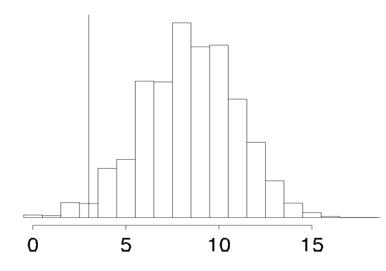

```{r setup, include=FALSE, echo = FALSE, message = FALSE}
knitr::opts_chunk$set(echo=TRUE, warning=FALSE, message=FALSE, 
                      dev.args = list(bg = 'transparent'), fig.align='center',
                      cache=TRUE)
require('tidyverse')
require('forcats')
require('rjags')
require('ggmcmc')
require('reshape2')
require('runjags')
require('dplyr')
require('gridExtra')
show = function(x) { x }
theme_set(theme_bw() + theme(plot.background=element_blank()) )
HDIofICDF = function( ICDFname , credMass=0.95 , tol=1e-8 , ... ) {
  # Arguments:
  #   ICDFname is R's name for the inverse cumulative density function
  #     of the distribution.
  #   credMass is the desired mass of the HDI region.
  #   tol is passed to R's optimize function.
  # Return value:
  #   Highest density iterval (HDI) limits in a vector.
  # Example of use: For determining HDI of a beta(30,12) distribution, type
  #   HDIofICDF( qbeta , shape1 = 30 , shape2 = 12 )
  #   Notice that the parameters of the ICDFname must be explicitly named;
  #   e.g., HDIofICDF( qbeta , 30 , 12 ) does not work.
  # Adapted and corrected from Greg Snow's TeachingDemos package.
  incredMass =  1.0 - credMass
  intervalWidth = function( lowTailPr , ICDFname , credMass , ... ) {
    ICDFname( credMass + lowTailPr , ... ) - ICDFname( lowTailPr , ... )
  }
  optInfo = optimize( intervalWidth , c( 0 , incredMass ) , ICDFname=ICDFname ,
                      credMass=credMass , tol=tol , ... )
  HDIlowTailPr = optInfo$minimum
  return( c( ICDFname( HDIlowTailPr , ... ) ,
             ICDFname( credMass + HDIlowTailPr , ... ) ) )
}
```

<script type="text/x-mathjax-config">
  MathJax.Hub.Config({ TeX: { extensions: ["color.js"] }});
</script>

<script type="text/x-mathjax-config">
MathJax.Hub.Register.StartupHook("TeX Jax Ready",function () {
  var MML = MathJax.ElementJax.mml,
      TEX = MathJax.InputJax.TeX;

  TEX.Definitions.macros.bfrac = "myBevelFraction";

  TEX.Parse.Augment({
    myBevelFraction: function (name) {
      var num = this.ParseArg(name),
          den = this.ParseArg(name);
      this.Push(MML.mfrac(num,den).With({bevelled: true}));
    }
  });
});
</script>


```{r, child = "miincludes.Rmd"}

```


# introduction

## 3 pillars of BDA (recap)

<span style = "color:firebrick">parameter estimation</span>: 

$$\underbrace{P(\theta \, | \, D)}_{posterior} \propto \underbrace{P(\theta)}_{prior} \ \underbrace{P(D \, | \, \theta)}_{likelihood}$$

<span style = "color:white"> &nbsp; </span>

<span style = "color:firebrick">model comparison</span>

$$\underbrace{\frac{P(M_1 \mid D)}{P(M_2 \mid D)}}_{\text{posterior odds}} = \underbrace{\frac{P(D \mid M_1)}{P(D \mid M_2)}}_{\text{Bayes factor}} \ \underbrace{\frac{P(M_1)}{P(M_2)}}_{\text{prior odds}}$$

<span style = "color:white"> &nbsp; </span>

<span style = "color:firebrick">prediction</span>

<div style = "float:left; width:45%;">

<span style = "color:firebrick">prior predictive</span>

$$ P(D) = \int P(\theta) \ P(D \mid \theta) \ \text{d}\theta $$

<span style = "color:white"> &nbsp; </span>

</div>
<div style = "float:right; width:45%;">

<span style = "color:firebrick">posterior predictive</span>

$$ P(D \mid D') = \int P(\theta \mid D') \ P(D \mid \theta) \ \text{d}\theta $$


</div>  

## why model predictions?

<span style = "color:white"> &nbsp; </span>

1. model-based beliefs about what is likely to happen
    - practical decision making
2. model comparison
    - information criteria
    - Bayes factor
3. model criticism
    - is the model any good?
    - given belief in the model, should we be shocked by <span style = "font-style: italic">this</span> new observation? <div style="float: right; margin: 0px;">[<span style = "color:firebrick">$p$-values</span> ]</div>
        
    

## overview

|    | estimation | comparison | criticism
|:---|:---:|:---:|:---:|
|goal | which $\theta$, given $M$ & $D$? | which better: $M_0$ or $M_1$? | $M$ good model of $D$?
| method | Bayes rule | Bayes factor | $p$-value
|no. of models | 1 | 2 | 1
|$H_0$ | subset of $\theta$  | $P(\theta \mid M_0), P(D \mid \theta, M_0)$ | $P(\theta), P(D \mid \theta)$
|$H_1$ | ---  | $P(\theta \mid M_1), P(D \mid \theta, M_1)$ | ---
| prerequisites | $P(\theta), \alpha \times P(D \mid \theta)$  | --- | test statistic
| pros | lean, easy | intuitive, plausible, Ockham's razor | absolute
| cons | vagueness in ROPE | prior dependence, computational load | sample space?

## road map for today

<span style = "color:white"> &nbsp; </span>


<div style = "float:left; width:45%;">

<span style = "color:firebrick">NHST</span>

- inference, HDIs & ROPEs
- nested model comparison
- $p$-values

</div>
<div style = "float:right; width:45%;">
  
<span style = "color:firebrick">model criticism</span>  
  
- posterior predictive checks
- prior/posterior $p$-values
  
</div>  

# testing a null

## up next {.build}

<div>

<span style = "color:white"> &nbsp; </span>

compare 3 methods for testing a null hypothesis:

1. $p$-values
2. parameter inference with ROPEs
3. nested model comparison

<span style = "color:white"> &nbsp; </span>

</div>

<div>

running example:

<div style = "float:left; width:35%;">

$k=7$, $N=24$ $\rightarrow$ $\theta = 0.5?$

</div>
  
</div>
<div style = "float:right; width:55%;">


  
</div>  

## definition $p$-value

<span style = "color:white"> &nbsp; </span>

in the <span style = "color:firebrick">general case</span>, the <span style = "color:firebrick">$p$-value of observation $x$</span> under null hypothesis $H_0$, with sample space $X$, sampling distribution $P(\cdot \mid H_0) \in \Delta(X)$ and test statistic $t \colon X \rightarrow \mathbb{R}$ is:

$$ p(x ; H_0, X, P(\cdot \mid H_0), t) = \int_{\left\{ \tilde{x} \in X \ \mid \ t(\tilde{x}) \ge t(x) \right\}} P(\tilde{x} \mid H_0) \ \text{d}\tilde{x}$$ 

intuitive slogan: <span style = "color:firebrick">probability of at least as extreme outcomes</span>

<span style = "color:white"> &nbsp; </span>

for an <span style = "color:firebrick">exact test</span> we get:

$$ p(x ; H_0, X, P(\cdot \mid H_0)) = \int_{\left\{ \tilde{x} \in X \ \mid \ P(\tilde{x} \mid H_0) \le P(x \mid H_0) \right\}} P(\tilde{x} \mid H_0) \ \text{d}\tilde{x}$$ 

intuitive slogan: <span style = "color:firebrick">probability of at least as unlikely outcomes</span>


<div style = "position:absolute; top: 620px; right:60px;">
  notation: $\Delta(X)$ -- set of all probability measures over $X$
</div>

## NHST by $p$-value

- data: we flip $n=24$ times and observe $k = 7$ successes
- null hypothesis: $\theta = 0.5$
- sampling distribution: binomial distribution

$$ B(k ; n = 24, \theta = 0.5) = \binom{n}{k} \theta^{k} \, (1-\theta)^{n-k} $$

<span style = "color:white"> &nbsp; </span>


<div style = "float:left; width:45%;">
```{r}
binom.test(7,24)$p.value
```    
</div>
<div style = "float:right; width:45%;">
```{r, echo = FALSE, fig.align='center', fig.width=5, fig.height=3}
  
plotData = data.frame(x = 0:24, y = dbinom(0:24, 24, 0.5))
plotData2 = data.frame(x = c(0:7, 17:24), y = dbinom(c(0:7, 17:24), 24, 0.5))
sig.plot = ggplot(plotData, aes(x = x , y = y )) + geom_bar(stat = "identity", fill = "skyblue", width = 0.35) +
  geom_bar(data = plotData2, aes(x = x, y = y), stat = "identity", fill = "darkblue", width = 0.35) +
  geom_hline(yintercept=dbinom(7,24,0.5)) + xlab("k") + ylab("B(k | n = 24, theta = 0.5)") +
  # geom_text(data.frame(x = 3, y = 0.05, label = paste0("p = " , round(1-sum(dbinom(8:16, 24, 0.5)),3), collapse = "")), aes(x = x, y = y, label = label)) 
  geom_text(x = 3, y = 0.03, label = paste0("p = " , round(1-sum(dbinom(8:16, 24, 0.5)),3), collapse = ""))
sig.plot
```
</div>  


## posterior inference

- observed: $k = 7$ out of $N = 24$ flips came up heads
- goal: estimate $P(\theta \mid D)$ & determine posterior 95% HDI

```{r, echo = FALSE, results='hide', warning=FALSE, message=FALSE}
plotData = data.frame(theta = seq(0.01,1, by = 0.01),
                      post = dbeta(seq(0.01,1, by = 0.01), 8, 18 ))
hdi = HDIofICDF( qbeta , shape1 = 8 , shape2 = 18 )
hdiData = data.frame(theta = rep(hdi, each = 2),
                     post = c(0,dbeta(hdi, 8, 18), 0))
ggplot(plotData, aes(x = theta, y = post)) + xlim(0,1) + geom_line(color = "black") + ylab("posterior") +
  geom_line(data = hdiData, aes(x = theta, y = post), color = "skyblue", size = 1) +
  geom_text(x = mean(hdi), y = 1, label = "HDI: 0.14 - 0.48")

```


## ROPEs and credible values

<span style = "color:white"> &nbsp; </span>

<span style = "color:firebrick">regions of practical equivalence</span>

- small regions $[\theta - \epsilon, \theta + \epsilon]$ around each $\theta$
    - values (practically) indistinguishable from $\theta$
  
<span style = "color:white"> &nbsp; </span>
  
<span style = "color:firebrick">credible values</span>

- value $\theta$ is <span style = "color:darkgreen">rejectable</span> if its ROPE lies entirely outside of posterior HDI
- value $\theta$ is <span style = "color:darkgreen">believable</span>
 if its ROPE lies entirely whithin posterior HDI

<span style = "color:white"> &nbsp; </span>

<span style = "color:firebrick">NHST by ROPE for our example</span>

$\theta = 0.5$ is rejectable for all ROPEs with ca. $\epsilon \le 0.02$

## Bayes factors for NHST

- $M_0$: $\theta = 0.5$ & $k \sim \text{Binomial}(0.5, N)$
- $M_1$: $\theta \sim \text{Beta}(1,1)$ & $k \sim \text{Binomial}(\theta, N)$

<span style = "color:white"> &nbsp; </span>

<div style = "float:left; width:35%;">
<span style = "color:firebrick">straightforward</span>

$$
\begin{align*}
\text{BF}(M_0 > M_1) & = \frac{P(D \mid M_0)}{P(D \mid M_1)} \\
  & =
  \frac{\binom{N}{k} 0.5^{k} \, (1-0.5)^{N - k}}{\int_0^1 \binom{N}{k} \theta^{k} \, (1-\theta)^{N - k} \text{ d}\theta} \\
  & \approx `r round(0.5^7 * 0.5^(24-7) / beta(8, 25-7),3)`
\end{align*}
$$

</div>
<div style = "float:right; width:55%;">

<span style = "color:firebrick">Savage-Dickey</span>

```{r, echo = FALSE, results='hide', warning=FALSE, message=FALSE, fig.align='center', fig.width=5, fig.height=3}
plotData = data.frame(theta = seq(0.01,1, by = 0.01),
                      posterior = dbeta(seq(0.01,1, by = 0.01), 8, 18 ),
                      prior = dbeta(seq(0.01,1, by = 0.01), 1, 1))
plotData = melt(plotData, measure.vars = c("posterior", "prior")) %>% 
  rename(distribution = variable)
pointData = data.frame(x = c(0.5,0.5), y = c(dbeta(0.5,8,18),1))


ggplot(plotData, aes(x = theta, y = value, color = distribution)) + xlim(0,1) + geom_line() + ylab("probability") +
  geom_segment(aes(x = 0.52, y = 0, xend = 0.52, yend = 1), color = "darkgray") +
  geom_segment(aes(x = 0.48, y = 0, xend = 0.48, yend = dbeta(0.5,8,18)), color = "darkgray") +
  geom_segment(aes(x = 0.5, y = 1, xend = 0.52, yend = 1), color = "darkgray") +
  geom_segment(aes(x = 0.5, y = dbeta(0.5,8,18), xend = 0.48, yend = dbeta(0.5,8,18)), color = "darkgray") +
  annotate("point", x = 0.5, y = 1, color = "black") +
  annotate("point", x = 0.5, y = dbeta(0.5,8,18), color = "black") + 
  annotate("text", x = 0.25, y = 0.25, color = "darkgray", label = "P(0.5 | D, M1) = 0.516", size = 3) +
  annotate("text", x = 0.68, y = 0.75, color = "darkgray", label = "P(0.5 | M1) = 1", size = 3)

```

  
</div>  


## summary

<span style = "color:white"> &nbsp; </span>

| method   | result | interpretation 
|:---|:---:|:---:|
| $p$-value | $p \approx 0.064$  | do not reject $H_0$
| HDI+ROPE | $\text{HDI} \approx [0.14;0.48]$ | do not adopt $H_0$ (depends on $\epsilon$)
| Bayes Factor | $\text{BF}(M_0 > M_1) \approx 0.561$ | mini-evidence in favor of $H_1$


# comparison

## Jeffreys-Lindley paradox

<span style = "color:firebrick">"paradox"</span>: two established methods give contradictory results

<span style = "color:white"> &nbsp; </span>


```{r}
k = 49581
N = 98451
```


<div style = "float:left; width:45%;">

<span style = "color:firebrick">$p$-value NHST</span>

```{r}
binom.test(k, N)$p.value
```

reject $H_0$

</div>
<div style = "float:right; width:45%;">

<span style = "color:firebrick">Savage-Dickey BF</span>

```{r}
dbeta(0.5, k+1, N - k + 1)
```  

strong evidence in favor of $H_0$
</div>  

## simulation

- let the true bias be $\theta = 0.5$
- generate all possible outcomes $k$ keeping $N$ fixed
    - $N \in \{ 10, 100, 1000, 10000, 100000 \}$
    - true frequency of $k$ is $Binomial(k \mid N, \theta = 0.5)$
- look at the frequency of test results, coded thus:

<span style = "color:white"> &nbsp; </span>
<span style = "color:white"> &nbsp; </span>


|    | estimation | comparison | criticism
|:---|:---:|:---:|:---:|
|$M_0$ | $[.5-\epsilon, 0.5+\epsilon] \sqsubseteq$ 95% HDI or v.v. | BF($M_0$>$M_1$) > 6 | $p$ > 0.05
|$M_1$ | $[.5-\epsilon, 0.5+\epsilon] \, \cap \,$ 95% HDI $=\emptyset$ | BF($M_1$>$M_0$) > 6 | $p$ <= 0.05
|?? | otherwise | otherwise | never

<div style = "position:absolute; top: 620px; right:60px;">
  (more on this [here](http://michael-franke.github.io/statistics/2016/09/30/Comparison_binomial.html))
</div>


## results

```{r, echo = FALSE}
load(file = "../data/05_results_binomial_comparison.Rdata")
```


```{r, echo = FALSE, results='hide', warning=FALSE, message=FALSE, fig.align='center', fig.width=6, fig.height = 4}

rf = results$result_frequencies
NList = c(10, 100, 1000, 10000, 100000)
BF_false = sapply(NList, function(i) sum(filter(rf, rule == "BF" & N == i & decision == "H1")$value))
names(BF_false) = paste0("N=", NList)
false_rejections = data.frame(frequency = c(sapply(NList, function(i) sum(filter(rf, rule == "p-value" & N == i & decision == "H1")$value)),
                                            sapply(NList, function(i) sum(filter(rf, rule == "BF" & 
                                                                                   N == i & 
                                                                                   decision == "H1")$value)),
                                            sapply(NList, function(i) sum(filter(rf, rule == "ROPE" & 
                                                                                   N == i & 
                                                                                   decision == "H1")$value))),
                              approach = factor(rep(c("p-value", "Bayes Factor", "ROPE"), each = length(NList)), levels = c("p-value", "Bayes Factor", "ROPE"), ordered = TRUE),
                              N = factor(rep(NList, times = 3))) 
myplot = ggplot(data = false_rejections, aes(x = N, y = frequency, fill = approach)) + geom_bar(stat = "identity", position = "dodge") + ggtitle("probability of false rejections of true null") + ylab("probability") + xlab("sample size N")
show(myplot)

```

BF selects $H_0$ correctly with prob. `r round(sum(filter(results[[1]], BFdecision == "H0" & N == 10000)$frequency),3)` for $N = 10000$, and with `r round(sum(filter(results[[1]], BFdecision == "H0" & N == 100000)$frequency),3)` for $N = 100000$.


<div style = "position:absolute; top: 620px; right:60px;">
  [c.f., Lindley's solution to 'paradox': adjust $p$ depending on $N$; similar for ROPE's $\epsilon$]
</div>

# model criticism

## motivation

- parameter estimation: what $\theta$ to believe in?
- model comparison: which model is better than another?
- <span style = "color:firebrick">model criticism</span>: is a given model plausible (enough)?

<span style = "color:white"> &nbsp; </span>
<span style = "color:white"> &nbsp; </span>


<div style = "float:left; width:45%;">
  <span style = "color:firebrick">posterior predictive checks</span>
  
  graphically compare simulated observations with actual observation
</div>
<div style = "float:right; width:45%;">
  <span style = "color:firebrick">Bayesian predictive $p$-values</span>
  
  measure surprise level of data under a model
  
  [think: $p$-value for a non-trivial, serious model with potential uncertainty about parameters]
</div>  

## posterior predictive checks

exponential forgetting model

```{r}
y = c(.94, .77, .40, .26, .24, .16)
t = c(  1,   3,   6,   9,  12,  18)
obs = y*100
```

```{r, eval = FALSE}
model{
  a ~ dunif(0,1.5)
  b ~ dunif(0,1.5)
  for (i in 1: 6){
    p[i] = min(max( a*exp(-t[i]*b), 0.0001), 0.9999)
    obs[i] ~ dbinom(p[i], 100)    # condition on data
    obsRep[i] ~ dbinom(p[i], 100) # replicate fake data
  }
}
```

## PPC: exponential model


```{r, results='hide', warning=FALSE, message=FALSE, echo = FALSE, fig.align = 'center', fig.width=6, fig.height=4}
modelString = "
model{
  a ~ dunif(0,1.5)
  b ~ dunif(0,1.5)
  for (i in 1: 6){
    p[i] = min(max( a*exp(-t[i]*b), 0.0001), 0.9999)
    obs[i] ~ dbinom(p[i], 100)    # condition on data
    obsRep[i] ~ dbinom(p[i], 100) # replicate fake data
  }
}"
# prepare for JAGS
dataList = list(obs = obs, t = t)
# set up and run model
jagsModel = jags.model(file = textConnection(modelString), 
                       data = dataList,
                       n.chains = 1)
update(jagsModel, n.iter = 10000)
codaSamples = coda.samples(jagsModel, 
                           variable.names = c("obsRep"),
                           n.iter = 10000)
PPCdata = data.frame(t = t,
                     y = summary(codaSamples)[[1]][,"Mean"],
                     HDIlow = HPDinterval(codaSamples[[1]])[,1],
                     HDIhig = HPDinterval(codaSamples[[1]])[,2]
                      )
forgetData = data.frame(t = t, obs = obs)
ggplot(forgetData, aes(x = t, y = obs)) + geom_point() +
  annotate("pointrange", x = t, y = as.vector(summary(codaSamples)[[1]][,"Mean"]), 
           ymin = HPDinterval(codaSamples[[1]])[,1], 
           ymax = HPDinterval(codaSamples[[1]])[,2], color = "skyblue")
```

- black dots: data
- <span style = "color:skyblue">blue dots</span>: mean of replicated fake data
- <span style = "color:skyblue">blue bars</span>: 95% HDIs of replicated fake data

## PPC: power model

```{r, results='hide', warning=FALSE, message=FALSE, echo = FALSE, fig.align = 'center', fig.width=6, fig.height=4}
modelString = "
model{
  c ~ dunif(0,1.5)
  d ~ dunif(0,1.5)
  for (i in 1: 6){
    p[i] = min(max( c*t[i]^(-d) , 0.0001), 0.9999)
    obs[i] ~ dbinom(p[i], 100)    # condition on data
    obsRep[i] ~ dbinom(p[i], 100) # replicate fake data
  }
}"
# prepare for JAGS
dataList = list(obs = obs, t = t)
# set up and run model
jagsModel = jags.model(file = textConnection(modelString), 
                       data = dataList,
                       n.chains = 1)
update(jagsModel, n.iter = 10000)
codaSamples = coda.samples(jagsModel, 
                           variable.names = c("obsRep"),
                           n.iter = 10000)
PPCdata = data.frame(t = t,
                     y = summary(codaSamples)[[1]][,"Mean"],
                     HDIlow = HPDinterval(codaSamples[[1]])[,1],
                     HDIhig = HPDinterval(codaSamples[[1]])[,2]
                      )
forgetData = data.frame(t = t, obs = obs)
ggplot(forgetData, aes(x = t, y = obs)) + geom_point() +
  annotate("pointrange", x = t, y = as.vector(summary(codaSamples)[[1]][,"Mean"]), 
           ymin = HPDinterval(codaSamples[[1]])[,1], 
           ymax = HPDinterval(codaSamples[[1]])[,2], color = "skyblue")
```

- black dots: data
- <span style = "color:skyblue">blue dots</span>: mean of replicated fake data
- <span style = "color:skyblue">blue bars</span>: 95% HDIs of replicated fake data


## Bayesian predictive model criticism

- fix a data set $x$ from a set of possible observations $X$
- fix a model $M$ with $P(\theta)$ and $P(X = x \mid \theta)$
    - NB: $P(\theta)$ can be conditioned on data: prior/posterior predictive $p$-value
- fix a <span style = "color:firebrick">test statistic</span> $t \colon X, \theta \rightarrow \mathbb{R}$
    - test statistic may depend on parameters 
- Bayesian predictive $p$-value:

$$ p(x ; X, M = \tuple{P(\theta), P(x\mid\theta)}, t) = \int_{\left\{ \tilde{x} \in X \ \mid \ t(\tilde{x},\theta) \ge t(x, \theta) \right\}} \int P(\tilde{x} \mid \theta) P(\theta) \ \text{d}\theta \ \text{d}\tilde{x}$$

<span style = "color:white"> &nbsp; </span>

- compare to standard $p$-value definition:

$$ p(x ; H_0, X, P(\cdot \mid H_0), t) = \int_{\left\{ \tilde{x} \in X \ \mid \ t(\tilde{x}) \ge t(x) \right\}} P(\tilde{x} \mid H_0) \ \text{d}\tilde{x}$$ 


## example

```{r}
obs = c(1, 1, 0, 0, 0, 0, 0, 1, 1, 1, 1, 1, 0, 0, 0, 0, 0, 0, 0, 0)
k = sum(obs) # 7
N = length(obs) #20
```

<div style = "float:left; width:45%;">

<span style = "color:firebrick">$p$-value NHST:</span>

- do not reject NH $\theta = 0.5$

```{r}
binom.test(k, N, 0.5)$p.value
```  
</div>
<div style = "float:right; width:45%;">
  
<span style = "color:firebrick">Bayesian posterior predictive $p$-value</span>
  
- test statistic: no. switches 1 <-> 0
- $t(d^*)$ = 2
- PP-$p$-value $\approx 0.028$

<div align = 'center'>
  
</div>

<div align = 'right'>
  Gelman et al. 2014, p.147--8
</div>

</div>

# summary

## summary

<span style = "color:white"> &nbsp; </span>

|    | estimation | comparison | criticism
|:---|:---:|:---:|:---:|
|goal | which $\theta$, given $M$ & $D$? | which better: $M_0$ or $M_1$? | $M$ good model of $D$?
| method | Bayes rule | Bayes factor | $p$-value
|no. of models | 1 | 2 | 1
|$H_0$ | subset of $\theta$  | $P(\theta \mid M_0), P(D \mid \theta, M_0)$ | $P(\theta), P(D \mid \theta)$
|$H_1$ | ---  | $P(\theta \mid M_1), P(D \mid \theta, M_1)$ | ---
| prerequisites | $P(\theta), \alpha \times P(D \mid \theta)$  | --- | test statistic
| pros | lean, easy | intuitive, plausible, Ockham's razor | absolute
| cons | vagueness in ROPE | prior dependence, computational load | sample space?


## outlook

<span style = "color:white"> &nbsp; </span>

<span style = "color:firebrick">Friday</span>

- bootcampling GCM (Lee & Wagenmakers ch. 17)

<span style = "color:white"> &nbsp; </span>

<span style = "color:firebrick">Tuesday</span>

- introduction to Stan


