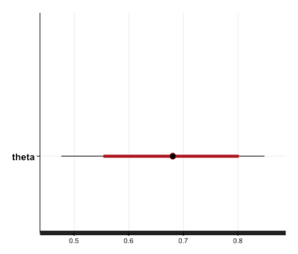
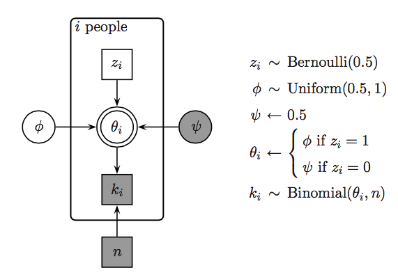

```{r setup, include=FALSE, echo = FALSE, message = FALSE}
knitr::opts_chunk$set(echo=TRUE, warning=FALSE, message=FALSE, 
                      dev.args = list(bg = 'transparent'), fig.align='center',
                      cache=TRUE)
require('tidyverse')
require('forcats')
require('rjags')
require('ggmcmc')
require('reshape2')
require('runjags')
require('dplyr')
require('gridExtra')
require('rstan')
show = function(x) { x }
theme_set(theme_bw() + theme(plot.background=element_blank()) )
```

<script type="text/x-mathjax-config">
  MathJax.Hub.Config({ TeX: { extensions: ["color.js"] }});
</script>

<script type="text/x-mathjax-config">
MathJax.Hub.Register.StartupHook("TeX Jax Ready",function () {
  var MML = MathJax.ElementJax.mml,
      TEX = MathJax.InputJax.TeX;

  TEX.Definitions.macros.bfrac = "myBevelFraction";

  TEX.Parse.Augment({
    myBevelFraction: function (name) {
      var num = this.ParseArg(name),
          den = this.ParseArg(name);
      this.Push(MML.mfrac(num,den).With({bevelled: true}));
    }
  });
});
</script>


```{r, child = "miincludes.Rmd"}

```


## overview


<span style = "color:white"> &nbsp; </span>


- Metropolis Hastings (recap)
- Hamiltonian Monte Carlo
- Stan


# Metropolis Hastings

## island hopping

<div align = 'center'>

</div>

- set of islands $X = \{x_1, x_2, \dots x_n\}$
- goal: hop around & visit every island $x_i$ proportional to its population $P(x_i)$
    - think: "samples" from $X \sim P$ 
- problem: island hopper can remember at most 2 islands' population
    - think: we don't know the normalizing constant

## Metropolis Hastings

- let $f(x) = \alpha P(x)$ (e.g., unnormalized posterior)
- start at random $x^0$, define probability $P_\text{trans}(x^i \rightarrow x^{i+1})$ of going from $x^{i}$ to $x^{i+1}$
    - <span style = "color:black">proposal</span> $P_\text{prpsl}(x^{i+1} \mid x^i)$: prob. of considering jump to $x^{i+1}$ from $x^{i}$
    - <span style = "color:black">acceptance</span> $P_\text{accpt}(x^{i+1} \mid x^i)$: prob of making jump when $x^{i+1}$ is proposed
      $$P_\text{accpt}(x^{i+1} \mid x^i) = \text{min} \left (1, \frac{f(x^{i+1})}{f(x^{i})} \frac{P_\text{prpsl}(x^{i} \mid x^{i+1})}{P_\text{prpsl}(x^{i+1} \mid x^i)} \right)$$
    - <span style = "color:black">transition</span> $P_\text{trans}(x^i \rightarrow x^{i+1}) = P_\text{prpsl}(x^{i+1} \mid x^i) \times P_\text{accpt}(x^{i+1} \mid x^i)$ 


## influence of proposal distribution

<div class = "centered">

</div>

# Hamiltonian MC

## Hamiltonian motion


<div style = "float:left; width:70%;">
- Hamiltonian movement
    - reformulates classical mechanics
    - precursor of statistical physics
    - closed system differential equations
    - <span style = "color:firebrick">potential vs. kinetic energy</span>
    
</div>
<div style = "float:right; width:25%;">
<div class = "right">

</div>  
</div>  

<span style = "color:white"> dummy </span>
<span style = "color:white"> dummy </span>
<span style = "color:white"> dummy </span>

<div style = "float:left; width:45%;">
  
  <span style = "color:firebrick">potential</span>
  
  <div class = "right">
  
  </div>
</div>
<div style = "float:right; width:45%;">
  
  <span style = "color:firebrick">kinetic</span>
  
  <div class = "right">
  
  </div>  
  
</div>  

## example 1

<div class = "centered">

</div>

## tuning parameters

- <span style = "color:firebrick">momentum</span>
    - e.g., standard deviation of Gaussian that determines initial jiggle

<span style = "color:white"> dummy </span>

- <span style = "color:firebrick">step size</span>
    - how big a step to take in discretization of gradient
    
<span style = "color:white"> dummy </span>    
    
- <span style = "color:firebrick">number of steps</span>
    - how many steps before producing the proposal
    


## example 2

<div class = "centered">

</div>

## example 3

<div class = "centered">

</div>

# Stan

## overview

<span style = "color:white"> &nbsp; </span>


<div style = "float:left; width:45%;">

- [mc-stan.org](http://mc-stan.org/)

- actively developed by Andrew Gelman, Bob Carpenter and others

- uses HMC and NUTS, but can do variational Bayes and MAPs too

- written in C++

- cross-platform

- interfaces: command line, Python, Julia, R, Matlab, Stata, Mathematica

- many additional packages/goodies

</div>
<div style = "float:right; width:45%;">
  
<div align = 'center'>
  
</div>

<span style = "color:white"> &nbsp; </span>


<div align = 'center'>
  
</div>
  
</div>  


## example: JAGS vs. Stan

<div style = "float:left; width:45%;">
```{r, results='hide', warning=FALSE, message=FALSE, eval = TRUE}
require('rjags')
ms = "
model{
  theta ~ dbeta(1,1)
  k ~ dbinom(theta, N)
}"
# prepare data for JAGS
dataList = list(k = 14, N = 20)
# set up and run model
jagsModel = jags.model(
  file = textConnection(ms), 
  data = dataList, n.chains = 2)
update(jagsModel, n.iter = 5000)
codaSamples = coda.samples(
  jagsModel, 
  variable.names = c("theta"),
  n.iter = 5000)
```  
</div>
<div style = "float:right; width:45%;">
```{r, results='hide', warning=FALSE, message=FALSE, eval = FALSE}
require('rstan')
ms = "
data {
  int<lower=0> N ;
  int<lower=0> k ;
}
parameters {
  real<lower=0,upper=1> theta ;
} 
model {
  theta ~ beta(1,1) ;
  k ~ binomial(N, theta) ;
}"
# prepare data for Stan
dataList = list(k = 14, N = 20)
# set up and run
mDso = stan_model(model_code = ms)
stanFit = sampling(object = mDso,
  data = dataList,
  chains = 2,
  iter = 10000,
  warmup = 5000)
```  
</div>  

```{r, results='hide', warning=FALSE, message=FALSE, eval = TRUE, echo = FALSE}
require('rstan')
ms = "
data {
  int<lower=0> N ;
  int<lower=0> k ;
}
parameters {
  real<lower=0,upper=1> theta ;
} 
model {
  theta ~ beta(1,1) ;
  k ~ binomial(N, theta) ;
}"
# prepare data for Stan
dataList = list(k = 14, N = 20)
# set up and run
mDso = stan_model(model_code = ms)
stanFit = sampling(object = mDso, show_messages = FALSE, refresh = -1, verbose = FALSE,
  data = dataList,
  chains = 2,
  iter = 10000,
  warmup = 5000)
```  

## compare output

<div style = "float:left; width:45%;">

<span style = "color:firebrick">JAGS</span>

```{r}
coda::effectiveSize(codaSamples)
```

<span style = "color:white"> &nbsp; </span>

```{r, fig.align = 'center', fig.width=5, fig.height=2.8, eval=TRUE}
ms = ggs(codaSamples)
ggs_density(ms)
```

</div>

<div style = "float:right; width:45%;">

<span style = "color:firebrick">Stan</span>

```{r}
coda::effectiveSize(As.mcmc.list(stanFit))[1]
```

<span style = "color:white"> &nbsp; </span>

```{r, fig.align = 'center', fig.width=5, fig.height=2.8, eval=TRUE}
ms = ggs(stanFit)
ggs_density(ms)
```

  
</div>  


## Stan output

<div style = "float:left; width:30%;">
```{r, eval = FALSE}
plot(stanFit)
```

<div align = 'center'>
  
</div>

</div>
<div style = "float:right; width:65%;">

```{r, eval = TRUE}
print(stanFit, digits_summary = 1)
```
  
</div>  


## `bayesplot` package

<span style = "color:white"> &nbsp; </span>
<span style = "color:white"> &nbsp; </span>


<div style = "float:left; width:45%;">
```{r fig.align = 'center', fig.width=4, fig.height=3, eval = FALSE}
require(bayesplot)
posterior <- as.array(stanFit)
color_scheme_set("red")
mcmc_areas(
  posterior, 
  pars = c("theta"),
  prob = 0.8, # 80% intervals
  prob_outer = 0.99, # 99%
  point_est = "mean"
)
```
</div>
<div style = "float:right; width:45%;">
```{r fig.align = 'center', fig.width=4, fig.height=3, eval = TRUE, echo = FALSE}
require(bayesplot)
posterior <- as.array(stanFit)
color_scheme_set("red")
mcmc_areas(
  posterior, 
  pars = c("theta"),
  prob = 0.8, # 80% intervals
  prob_outer = 0.99, # 99%
  point_est = "mean"
)
```  
</div>  

<div style = "position:absolute; top: 620px; right:60px;">
  more on the `bayesplot` package: [here](https://cran.r-project.org/web/packages/bayesplot/index.html)
</div>


# discrete latent parameters

## discrete latent parameters

<span style = "color:white"> dummy </span>
<span style = "color:white"> dummy </span>


<div style = "float:left; width:45%;">

<span style = "color:firebrick">problem</span>


Stan needs gradients / derivatives

- cannot infer discrete latent parameters 

  
</div>
<div style = "float:right; width:45%;">

<span style = "color:firebrick">(sometimes) possible solution</span>

marginalize out

  
</div>  


## Exam scores

<div style = "float:left; width:55%;">

15 people answered 40 exam questions. Here's their scores:

```{r}
k <- c(21,17,21,18,22,31,31,34,
       34,35,35,36,39,36,35)
p <- length(k) #number of people
n <- 40 # number of questions
```

- assume that some guessed randomly, others gave informed answers
- who is a guesser? 
- what's the probability of correct answering for non-guessers?

  
</div>
<div style = "float:right; width:35%;">


```{r, echo = FALSE, fig.align = 'center', fig.width=4, fig.height=3,}
tibble(subject = 1:p, success.rate = k/n) %>% ggplot(aes(x = subject, y = success.rate)) + geom_bar(stat = "identity")
```

</div>  


<div style = "position:absolute; top: 620px; right:60px;">
<span style = "color:darkgray">Lee & Wagenmakers, Chapter 6.1</span>  
</div>


## JAGS model

```{r, eval = FALSE}
k <- c(21,17,21,18,22,31,31,34,
       34,35,35,36,39,36,35)
p <- length(k) #number of people
n <- 40 # number of questions
```

<div style = "float:left; width:45%;">
  
<div align = 'center'>
  
</div>
  
</div>
<div style = "float:right; width:50%;">

```{r, eval = FALSE}
model{
  for (i in 1:p){
    z[i] ~ dbern(0.5)
  }
  psi = 0.5
  phi ~ dunif(0.5,1)
  for (i in 1:p){
    theta[i] = ifelse(z[i]==0,psi,phi)
    k[i] ~ dbin(theta[i],n)
  }
}
```
  
</div>  

## JAGS model: results

```{r, echo = FALSE, results='hide', warning=FALSE, message=FALSE}
modelString = "
model{
  for (i in 1:p){
    z[i] ~ dbern(0.5)
  }
  psi = 0.5
  phi ~ dunif(0.5,1)
  for (i in 1:p){
    theta[i] = ifelse(z[i]==0,psi,phi)
    k[i] ~ dbin(theta[i],n)
  }
}"
dataList = list(p = p, k = k, n = n)
jagsModel = jags.model(file = textConnection(modelString), 
                       data = dataList,
                       n.chains = 2)
update(jagsModel, n.iter = 5000)
codaSamples = coda.samples(jagsModel, 
                           variable.names = c("phi","z"),
                           n.iter = 5000)
ms = ggs(codaSamples)
```

```{r}
k <- c(21,17,21,18,22,31,31,34,34,35,35,36,39,36,35)
show(summary(codaSamples)[[1]][,1:2])
```


## model: JAGS vs Stan

<div style = "float:left; width:35%;">
```{r, eval = FALSE}
model{
  for (i in 1:p){
    z[i] ~ dbern(0.5)
  }
  psi = 0.5
  phi ~ dunif(0.5,1)
  for (i in 1:p){
    theta[i] = ifelse(z[i]==0,
                      psi,phi)
    k[i] ~ dbin(theta[i],n)
  }
}
```  

<span style = "color:firebrick">JAGS $\uparrow$</span>

<span style = "color:white"> &nbsp; </span>
<span style = "color:white"> &nbsp; </span>


<div align = 'center'>
<span style = "color:firebrick">Stan $\rightarrow$</span>  
</div>


</div>
<div style = "float:right; width:60%;">

```{c++, eval = FALSE}
data { 
  int<lower=1> p;  int<lower=0> k[p];   int<lower=1> n;
}
transformed data {
  real psi; psi <- .5;
}
parameters {
  real<lower=.5,upper=1> phi; 
} 
transformed parameters {
  vector[2] log_alpha[p];
  for (i in 1:p) {
    log_alpha[i,1] <- log(.5) + binomial_log(k[i], n, phi);
    log_alpha[i,2] <- log(.5) + binomial_log(k[i], n, psi); 
  }
}
model {
  for (i in 1:p)
    increment_log_prob(log_sum_exp(log_alpha[i]));  
}
generated quantities {
  int<lower=0,upper=1> z[p];
  for (i in 1:p) {
    z[i] <- bernoulli_rng(softmax(log_alpha[i])[1]);
  }
}
```
</div>  

## log-scores & marginalizing out

<span style = "color:firebrick">log score</span> 

- $\log P(D, \theta) = \log \left( P(\theta) \ P(D \mid \theta) \right ) = \log P(\theta) + \log P(D \mid \theta)$
- log-score for one participant in our example: 

$$\log P(k_i, n, z_i, \phi) = \log \text{Bern}(z_i \mid 0.5) + \log \text{Binom}(k_i, n, \text{ifelse}(z=1, \phi, 0.5))$$

<span style = "color:firebrick">marginalizing out</span> 

$$ \begin{align*}
P(k_i, n, \phi) & = \sum_{z_i \in \set{0,1}} \text{Bern}(z_i \mid 0.5) \ \text{Binom}(k_i, n, \text{ifelse}(z=1, \phi, 0.5)) \\
                & = \text{Bern}(0 \mid 0.5) \ \text{Binom}(k_i, n, 0.5)) + \\
                & \ \ \ \ \ \ \ \ \ \ \text{Bern}(1 \mid 0.5) \ \text{Binom}(k_i, n, \phi)) \\
                & = \underbrace{0.5 \ \text{Binom}(k_i, n, 0.5))}_{\alpha_0} + \underbrace{0.5 \ \text{Binom}(k_i, n, \phi))}_{\alpha_1} \\
\log P(k_i, n, \phi)  & = \log \sum_{i=0}^1 \exp \log \alpha_i
\end{align*}$$

## Stan model: results

```{r, echo = FALSE, results='hide', warning=FALSE, message=FALSE}

model <- "
// Exam Scores
data { 
  int<lower=1> p;
  int<lower=0> k[p];
  int<lower=1> n;
}
transformed data {
  real psi;
  // First Group Guesses
  psi <- .5;
}
parameters {
  // Second Group Has Some Unknown Greater Rate Of Success
  real<lower=.5,upper=1> phi; 
} 
transformed parameters {
  vector[2] lp_parts[p];
  // Data Follow Binomial With Rate Given By Each Person's Group Assignment
  for (i in 1:p) {
    lp_parts[i,1] <- log(.5) + binomial_log(k[i], n, phi);
    lp_parts[i,2] <- log(.5) + binomial_log(k[i], n, psi); 
  }
}
model {
  for (i in 1:p)
    increment_log_prob(log_sum_exp(lp_parts[i]));  
}
generated quantities {
  int<lower=0,upper=1> z[p];
  for (i in 1:p) {
    z[i] <- bernoulli_rng(softmax(lp_parts[i])[1]);
  }
}"

k <- c(21, 17, 21, 18, 22, 31, 31, 34, 34, 35, 35, 36, 39, 36, 35)
p <- length(k)  # number of people
n <- 40  # number of questions

data <- list(p=p, k=k, n=n) # to be passed on to Stan

parameters <- c("phi", "z")  # parameters to be monitored

samples <- stan(model_code=model,   
                data=data, 
                pars=parameters,
                iter=10000, 
                chains=2, 
                thin=1,
                warmup = 5000  
)

plot(samples, digits = 3, )

```


# added goodies

## variational Bayes

<span style = "color:white"> &nbsp; </span>

<span style = "color:firebrick">idea</span>

approximate posterior distribution by a well-behaved function

<span style = "color:white"> &nbsp; </span>

<span style = "color:firebrick">concretely</span>

find parametric function $F(\theta \mid \phi)$ and look for best-fitting parameters:

$$\phi^* = \arg\min_{\phi} \text{KL}(F(\theta \mid \phi) \ \  || \ \ P(\theta \mid D)  )   $$

where KL is the Kullback-Leibler divergence:

$$ \text{KL}(P || Q) = \int P(x) \log \frac{P(x)}{Q(x)} \ \text{d}x $$ 

## maximum a posteriori (MAP)

<span style = "color:white"> &nbsp; </span>

the MAP is the most likely parameter vector under the posterior distribution:

$$ \theta^* = \arg\max_{\theta} P(\theta \mid D) $$


<span style = "color:white"> &nbsp; </span>

for flat (possibly improper) priors the MAP is the MLE

# summary

## comparison

|  | JAGS | Stan | 
|:---|:---:|:---:|
| syntax-style | BUGS, R | C++, R, BUGS
| sampler | MH, Gibbs | Hamiltonian
| paradigm | declarative | procedural
| precompilation | no | yes
| latent discrete variables | yes | hard (or impossible)
| added goodies | DIC | variational Bayes, MAP, improper priors, rstanarm, loo, ...

## outlook

<span style = "color:white"> &nbsp; </span>

<span style = "color:firebrick">Friday</span>

- bootcamping with a cognitive model in Stan

<span style = "color:white"> &nbsp; </span>

<span style = "color:firebrick">Tuesday</span>

- generalized linear model


