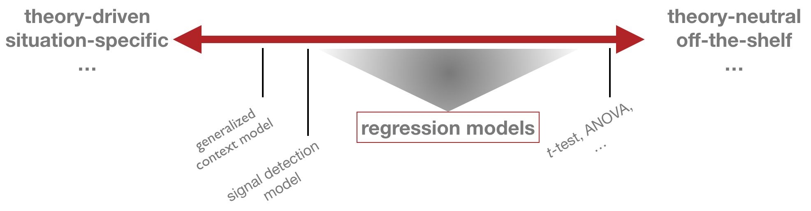

```{r setup, include=FALSE, echo = FALSE, message = FALSE}
knitr::opts_chunk$set(echo=TRUE, warning=FALSE, message=FALSE, 
                      dev.args = list(bg = 'transparent'), fig.align='center',
                      cache=TRUE)
require('tidyverse')
require('forcats')
require('rjags')
require('ggmcmc')
require('reshape2')
require('runjags')
require('dplyr')
require('gridExtra')
require('rstan')
show = function(x) { x }
theme_set(theme_bw() + theme(plot.background=element_blank()) )
```

<script type="text/x-mathjax-config">
  MathJax.Hub.Config({ TeX: { extensions: ["color.js"] }});
</script>

<script type="text/x-mathjax-config">
MathJax.Hub.Register.StartupHook("TeX Jax Ready",function () {
  var MML = MathJax.ElementJax.mml,
      TEX = MathJax.InputJax.TeX;

  TEX.Definitions.macros.bfrac = "myBevelFraction";

  TEX.Parse.Augment({
    myBevelFraction: function (name) {
      var num = this.ParseArg(name),
          den = this.ParseArg(name);
      this.Push(MML.mfrac(num,den).With({bevelled: true}));
    }
  });
});
</script>


```{r, child = "miincludes.Rmd"}

```


## overview

<span style = "color:white"> &nbsp; </span>


- generalized linear model (GLM)
    - types of variables
        - metric, nominal, ordinal, count
- linear model
    - ordinary least squares regresssion
    - maximum likelihood regression
    - Bayesian approaches
- generalization to $t$-test & one-way ANOVA
- robust regression

# generalized linear model

## probabilistic models

<span style = "color:white"> &nbsp; </span>


<div style = "float:left; width:45%;">

<span style = "color:firebrick">standard notion</span>

model = likelihood function $P(D \mid \theta)$

</div>
<div style = "float:right; width:45%;">

<span style = "color:firebrick">Bayesian</span>

model = likelihood $P(D \mid \theta)$ + prior $P(\theta)$  

</div>  

<div style = "position:absolute; top: 320px;">

<span style = "color:firebrick">approaches to modeling</span>

<div style = "float:left; width:10%;">
<span style = "color:white"> &nbsp; </span>
</div>
<div style = "float:right; width:85%;">
<div align = 'center'>

</div>  
</div>  

</div>  


## generalized linear model

<span style = "color:white"> &nbsp; </span>


<span style = "color:firebrick">terminology</span>

- $y_i$ data, observation, <span style = "color:darkgreen">predicted variable</span>, ...
- $x_i$ vector of <span style = "color:darkgreen">predictors</span> for $y_i$, explanatory variables, ...

<span style = "color:white"> &nbsp; </span>


<span style = "color:firebrick">blueprint of a GLM</span>

$$ 
\begin{align*} 
\text{linear_predictor} & = \text{linear_combination}(x_i)  \\
\text{central_tendency} & = \text{link_fun}( \ \text{linear_predictor}, \theta_{\text{LF}} \ )  \\
y_i & \sim \text{lh_fun}( \ \text{predicted_value}, \ \theta_{\text{LH}} \ )
\end{align*}
$$ 

<div align = 'center'>
  
</div>

# old stuff

# link functions in the generalized linear model

## recap: simple regression

<span style = "color:firebrick">data</span>


<div style = "float:left; width:35%;">
```{r, warnings = FALSE, message = FALSE}
head(cars) 
```
  
</div>
<div style = "float:right; width:65%;">
```{r, message = FALSE, warnings = FALSE, echo = FALSE, fig.width=4, fig.height=2.5}
coeff = coef(lm(formula = dist ~ speed, data = cars)) # get slope & intercept of linear model
qplot(cars[,'speed'], cars[,'dist']) + xlab('speed') + ylab('distance') + theme_bw() + 
  geom_abline(intercept = coeff[1], slope = coeff[2], color = "firebrick")
```  
</div>  

<span style = "color:white"> dummy </span>

<span style = "color:firebrick">model</span>

<div style = "float:left; width:45%;">
$$\beta_0, \beta_1 \sim \text{Norm}(0, 1000)$$
$$\sigma^2_{\epsilon} \sim \text{Unif}(0, 1000)$$
</div>
<div style = "float:right; width:45%;">
$$\mu_i = \beta_0 + \beta_1 x_i$$
$$y_i \sim \text{Norm}(\mu_i, \sigma^2_{\epsilon})$$
</div>  

## types of variables

| type | examples 
|:---|:---:|
| metric |  speed of a car, reading time
| binary | coin flip, truth-value judgement
| nominal | gender, political party
| ordinal | level of education, rating scale judgement

## generalized linear model

<div align = 'center'>
  
</div>

## common link & likelihood functions

| type of $y$ | (inverse) link function | likelihood function | 
|:---|:---:|:---:|
| metric |  $\mu = \eta$ | $y \sim \text{Normal}(\mu, \sigma)$
| binary | $\mu = \text{logistic}(\eta, \theta, \gamma) = (1 + \exp(-\gamma (\eta - \theta)))^{-1}$ | $y \sim \text{Binomial}(\mu)$
| nominal | $\mu_k = \text{soft-max}(\eta_k, \lambda) \propto \exp(\lambda \eta_k)$ | $y \sim \text{Multinomial}(\vec{\mu})$
| ordinal | $\mu_k = \text{threshold-Phi}(\eta_k, \sigma, \vec{\delta})$ | $y \sim \text{Multinomial}(\vec{\mu})$
| count | $\mu = \exp(\eta)$ | $y \sim \text{Poisson}(\mu)$

<span style = "color:white"> dummy </span>

<span style = "color:white"> dummy </span>

<span style = "color:white"> dummy </span>


<div style = "position:absolute; top: 620px; right:60px; color:darkblue;">
  (c.f., Kruschke (2015), Doing Bayesian Data Analysis, Chapter 15)
</div>

## logistic function

$$\text{logistic}(\eta, \theta, \gamma) = \frac{1}{(1 + \exp(-\gamma (\eta - \theta)))}$$

<span style = "color:white"> dummy </span>

<span style = "color:white"> dummy </span>

<div style = "float:left; width:45%;">

<span style = "color:firebrick">threshold $\theta$</span>
```{r, message = FALSE, warnings = FALSE, echo = FALSE, fig.width=4, fig.height=2.5}

gamma = c(1.5, 1.5, 4, 4)
theta = c(0, 1, 0, 1)
myFun1 = function(x) return( 1 / (1 + exp(- gamma[1] * (x - theta[1]))) )
myFun2 = function(x) return( 1 / (1 + exp(- gamma[2] * (x - theta[2]))) )
myFun3 = function(x) return( 1 / (1 + exp(- gamma[3] * (x - theta[3]))) )
myFun4 = function(x) return( 1 / (1 + exp(- gamma[4] * (x - theta[4]))) )

ggplot(data.frame(x = c(-5,5)), aes(x)) +
         stat_function(fun = myFun1, aes(color = "0")) +
         stat_function(fun = myFun2, aes(color = "1")) +
        scale_colour_manual("theta", breaks = c("0", "1"), values = c("darkblue", "firebrick")) + ggtitle("gamma = 1.5")
```  
</div>
<div style = "float:right; width:45%;">

<span style = "color:firebrick">gain $\gamma$</span>
```{r, message = FALSE, warnings = FALSE, echo = FALSE, fig.width=4, fig.height=2.5}

gamma = c(1.5, 1.5, 4, 4)
theta = c(0, 1, 0, 1)
myFun1 = function(x) return( 1 / (1 + exp(- gamma[1] * (x - theta[1]))) )
myFun2 = function(x) return( 1 / (1 + exp(- gamma[2] * (x - theta[2]))) )
myFun3 = function(x) return( 1 / (1 + exp(- gamma[3] * (x - theta[3]))) )
myFun4 = function(x) return( 1 / (1 + exp(- gamma[4] * (x - theta[4]))) )

ggplot(data.frame(x = c(-5,5)), aes(x)) +
         stat_function(fun = myFun1, aes(color = "1.5")) +
         stat_function(fun = myFun3, aes(color = "4")) +
        scale_colour_manual("gamma", breaks = c("1.5", "4"), values = c("darkblue", "firebrick")) + ggtitle("theta = 0")
```  
</div>  

## threshold-Phi model

<div align = 'center'>
  
</div>

<div style = "position:absolute; top: 620px; right:60px; color:darkblue;">
  (c.f., Kruschke (2015), Doing Bayesian Data Analysis, Chapter 23)
</div>


# summary

## comparison

|  | JAGS | Stan | 
|:---|:---:|:---:|
| syntax-style | BUGS, R | C++, R, BUGS
| sampler | MH, Gibbs | Hamiltonian
| paradigm | declarative | procedural
| precompilation | no | yes
| latent discrete variables | yes | hard (or impossible)
| added goodies | DIC | variational Bayes, MAP, improper priors, rstanarm, loo, ...

## outlook

<span style = "color:white"> &nbsp; </span>

<span style = "color:firebrick">Friday</span>

- bootcamping with a cognitive model in Stan

<span style = "color:white"> &nbsp; </span>

<span style = "color:firebrick">Tuesday</span>

- generalized linear model


