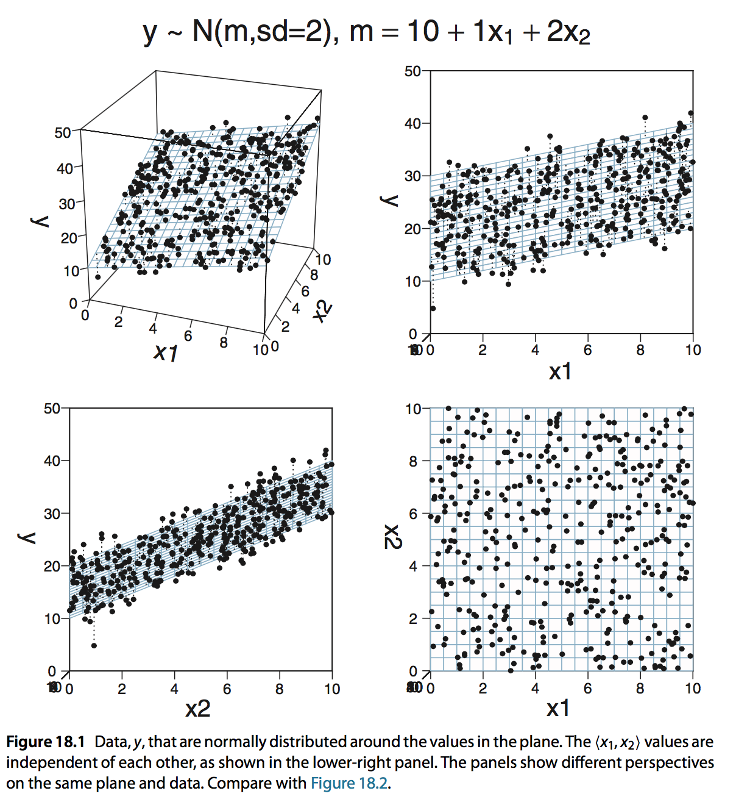
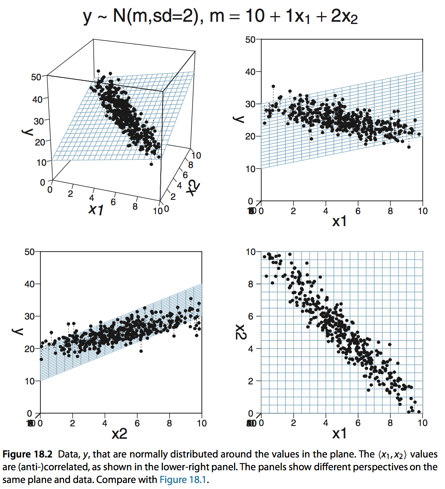
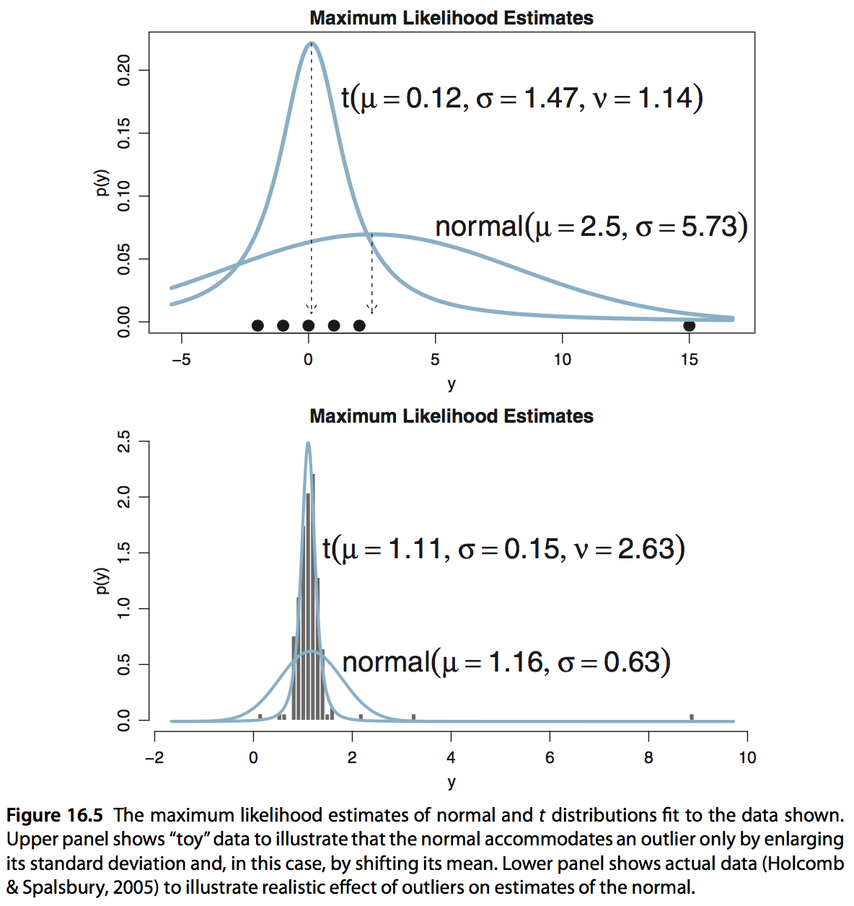

```{r setup, include=FALSE, echo = FALSE, message = FALSE}
knitr::opts_chunk$set(echo=TRUE, warning=FALSE, message=FALSE, 
                      dev.args=list(bg = 'transparent'), fig.align='center',
                      cache=TRUE)
require('tidyverse')
require('forcats')
require('rjags')
require('ggmcmc')
require('reshape2')
require('runjags')
require('dplyr')
require('gridExtra')
# require('rstan')
library(GGally)
library(BayesFactor)
library(brms)

show = function(x) { x }
theme_set(theme_bw() + theme(plot.background=element_blank()) )
```

<script type="text/x-mathjax-config">
  MathJax.Hub.Config({ TeX: { extensions: ["color.js"] }});
</script>

<script type="text/x-mathjax-config">
MathJax.Hub.Register.StartupHook("TeX Jax Ready",function () {
  var MML = MathJax.ElementJax.mml,
      TEX = MathJax.InputJax.TeX;

  TEX.Definitions.macros.bfrac = "myBevelFraction";

  TEX.Parse.Augment({
    myBevelFraction: function (name) {
      var num = this.ParseArg(name),
          den = this.ParseArg(name);
      this.Push(MML.mfrac(num,den).With({bevelled: true}));
    }
  });
});
</script>


```{r, child = "miincludes.Rmd"}

```


# recap

## generalized linear model

<span style = "color:white"> &nbsp; </span>


<div style = "float:left; width:35%;">
<span style = "color:firebrick">terminology</span>

- $y$ <span style = "color:darkgreen">predicted variable</span>, data, observation, ...
- $X$ <span style = "color:darkgreen">predictor variables</span> for $y$, explanatory variables, ...

<span style = "color:white"> &nbsp; </span>


<span style = "color:firebrick">blueprint of a GLM</span>

$$ 
\begin{align*} 
\eta & = \text{linear_combination}(X)  \\
\mu & = \text{link_fun}( \ \eta, \theta_{\text{LF}} \ )  \\
y & \sim \text{lh_fun}( \ \mu, \ \theta_{\text{LH}} \ )
\end{align*}
$$   
</div>
<div style = "float:right; width:55%;">

<div align = 'center'>
  
</div>  
</div>  

## common link & likelihood function

<span style = "color:white"> &nbsp; </span>


| type of $y$ | (inverse) link function | likelihood function | 
|:---|:---:|:---:|
| metric |  $\mu = \eta$ | $y \sim \text{Normal}(\mu, \sigma)$
| binary | $\mu = \text{logistic}(\eta, \theta, \gamma) = (1 + \exp(-\gamma (\eta - \theta)))^{-1}$ | $y \sim \text{Binomial}(\mu)$
| nominal | $\mu_k = \text{soft-max}(\eta_k, \lambda) \propto \exp(\lambda \eta_k)$ | $y \sim \text{Multinomial}({\mu})$
| ordinal | $\mu_k = \text{threshold-Phi}(\eta_k, \sigma, {\delta})$ | $y \sim \text{Multinomial}({\mu})$
| count | $\mu = \exp(\eta)$ | $y \sim \text{Poisson}(\mu)$

## linear regression: a Bayesian approach

<span style = "color:firebrick">Bayes: likelihood + prior</span>

inspect posterior distribution over $\beta_0$, $\beta_1$ and $\sigma_{\text{err}}$ given the data $y$ and the model:

$$ 
\begin{align*}
y_{\text{pred}} & = \beta_0 + \beta_1 x  & \ \ \ \ \ \ \ \ \ \ \ \ \ \ 
y & \sim \mathcal{N}(\mu = y_{\text{pred}}, \sigma_{err}) \\
\beta_i & \sim \mathcal{N}(0, \sigma_{\beta})  & \ \ \ \ \ \ \ \ \ \ \ \ \ \ 
\frac{1}{\sigma_{err}^2} & \sim \text{Gamma}(0.1,0.1)
\end{align*}
$$

```{r, eval = FALSE}
model{
  sigma_e = 1/sqrt(tau_e)
  tau_e ~ dgamma(0.1,0.1)
  b0 ~ dnorm(0, 1/10000000)
  b1 ~ dnorm(0, 1/10000000)
  for (i in 1:k){
    yPred[i] = b0 + b1 * x[i]
    y[i] ~ dnorm(yPred[i], tau_e)
  }
}
```

# overview

## overview

<span style = "color:white"> &nbsp; </span>

- linear models with several metric predictors
    - correlated predictors
- robust regresssion
- GLMs with other types of predictor variables
    - binary outcomes: <span style = "color:darkgreen"> logistic regression </span>  
    - nominal outcomes <span style = "color:darkgreen"> mulit-logit regression </span>  
    - ordinal outcomes: <span style = "color:darkgreen"> ordinal (logit/probit) regression </span>  
  
 
# LM with multiple predictors

## linear model

<div style = "float:left; width:45%;">

<span style = "color:firebrick">data</span>

- $y$: $n \times 1$ vector of <span style = "color:darkgreen"> predicted values </span> (metric)   

- $X$: $n \times k$ matrix of <span style = "color:darkgreen"> predictor values </span> (metric)  

<span style = "color:firebrick">parameters</span>

- $\beta$: $k \times 1$ vector of coefficients
- $\sigma_{err}$: standard deviation of Gaussian noise

<span style = "color:firebrick">model</span>

$$ 
\begin{align*}
\eta & = X_i \cdot \beta  & \ \ \ \ \ \ \ \ \ \ \ \ \ \ 
y_i & \sim \mathcal{N}(\mu = \eta_i, \sigma_{err}) \\
\end{align*}
$$ 

</div>


<div style = "float:right; width:45%;">

<span style = "color:firebrick">example</span>

```{r, echo = FALSE}
murder_data = readr::read_csv('../data/06_murder_rates.csv') %>% 
  rename(murder_rate = annual_murder_rate_per_million_inhabitants,
         low_income = percentage_low_income, 
         unemployment = percentage_unemployment) %>% 
  select(murder_rate, low_income, unemployment,population)
```


```{r}
murder_data %>% head
```


- predicted variable $y$: `murder_data[,1]`
- predictor matrix $X$: `murder_data[,2:3]` 

</div>  

## predictor variables beyond the raw data

<span style = "color:white"> &nbsp; </span>


<div style = "float:left; width:45%;">

<span style = "color:firebrick">intercept</span>

$X_{i,1} = 1$ for all $i$ 

<span style = "color:white"> &nbsp; </span>


<span style = "color:firebrick">interaction terms</span>

$X_{i,l} = X_{i,j} \cdot X_{i,k}$ for all $i$ with $j \neq k$

  
</div>
<div style = "float:right; width:45%;">


<span style = "color:firebrick">transformed variables</span>

$X_{i,k} = F(X_{i,j})$ (e.g., $F(x) = \log(x)$ or $F(x) = x^2$)
<span style = "color:white"> &nbsp; </span>

<span style = "color:white"> &nbsp; </span>


<span style = "color:firebrick">crazy terms$^*$</span>

$X_{i,l} = \exp((X_{i,j} - X_{i,k})^2 + \sqrt{X_{i,m}})$

  
</div>  


<div style = "position:absolute; top: 620px; right:60px;">
  $^*$ at which point it gets pointless to speak of a "linear model" still, even if formally subsumable
</div>

## recall: murder data

```{r}
GGally::ggpairs(murder_data, 
                title = "Murder rate data")
```

## multiple predictors

<span style = "color:firebrick">point estimates</span>

```{r}
glm(murder_rate ~ low_income + population, 
    data = murder_data) %>% 
  broom::tidy()
```

<div style = "float:left; width:45%;">

<span style = "color:firebrick">Bayes</span>

```{r echo = TRUE}
BF_fit_1 = BayesFactor::lmBF(
  murder_rate ~ low_income + population, 
  data = murder_data %>% as.data.frame)
post_samples_1 = BayesFactor::posterior(
  model = BF_fit_1, 
  iterations = 5000)
```
  
</div>
<div style = "float:right; width:45%;">

```{r echo = FALSE, fig.align='center', fig.width=4, fig.height=2.75}
ggmcmc::ggs(post_samples_1 %>% as.mcmc.list) %>% 
  filter(Parameter %in% c("low_income", "population")) %>% 
  ggplot(aes(x = value)) + geom_density() +
  facet_wrap(~ Parameter, scales = "free")
```


</div>  

## correlated predictors

<span style = "color:firebrick">point estimates</span>

```{r}
glm(murder_rate ~ low_income + unemployment, 
    data = murder_data) %>% 
  broom::tidy()
```

<div style = "float:left; width:45%;">

<span style = "color:firebrick">Bayes</span>

```{r echo = TRUE}
BF_fit_2 = BayesFactor::lmBF(
  murder_rate ~ low_income + unemployment, 
  data = murder_data %>% as.data.frame)
post_samples_2 = BayesFactor::posterior(
  model = BF_fit_2, 
  iterations = 5000)
```
  
</div>
<div style = "float:right; width:45%;">

```{r echo = FALSE, fig.align='center', fig.width=4, fig.height=2.75}
ggmcmc::ggs(post_samples_2 %>% as.mcmc.list) %>% 
  filter(Parameter %in% c("low_income", "unemployment")) %>% 
  ggplot(aes(x = value)) + geom_density() +
  facet_wrap(~ Parameter, scales = "free")
```

## known model with (un)correlated predictors

<div style = "float:left; width:45%;">

<span style = "color:firebrick">uncorrelated</span>

<div align = 'center'>
  
</div>

</div>
<div style = "float:right; width:45%;">

<span style = "color:firebrick">correlated</span>

<div align = 'center'>
  
</div>
  
</div>  


## joint posterior distribution

<span style = "color:white"> &nbsp; </span>


<div style = "float:left; width:45%;">

<span style = "color:firebrick">murder_rate ~ low_income + population</span>

```{r echo = FALSE, fig.align='center', fig.width=4, fig.height=2.75}
ggmcmc::ggs(post_samples_1 %>% as.mcmc.list) %>% 
  spread(Parameter, value = value) %>% 
  ggplot(aes(x = low_income, y = population)) + geom_point()
```

  
</div>
<div style = "float:right; width:45%;">

<span style = "color:firebrick">murder_rate ~ low_income + unemployment</span>

```{r echo = FALSE, fig.align='center', fig.width=4, fig.height=2.75}
ggmcmc::ggs(post_samples_2 %>% as.mcmc.list) %>% 
  spread(Parameter, value = value) %>% 
  ggplot(aes(x = low_income, y = unemployment)) + geom_point()
```

  
</div>  

## model comparison

```{r}
BF_group_fit = BayesFactor::regressionBF(
  murder_rate ~ low_income + unemployment + population,
  data = murder_data %>% as.data.frame)
plot(BF_group_fit)
```

## model comparison: perfect correlation

```{r echo = T, fig.align='center', fig.width=5, fig.height=3.5}
BF_group_fit = BayesFactor::regressionBF(
  murder_rate ~ low_income + inv_income,
  data = murder_data %>% 
    mutate(inv_income = -low_income) %>% 
    as.data.frame)
plot(BF_group_fit)
```

## model comparison: perfect correlation

```{r echo = T, fig.align='center', fig.width=5, fig.height=3.5}
BF_complex = BayesFactor::regressionBF(
  murder_rate ~ low_income + inv_income,
  rscaleCont = 5, # set a wider prior for all slopes
  data = murder_data %>% 
    mutate(inv_income = -low_income) %>% 
    as.data.frame)
plot(BF_complex)
```


## correlated predictors: summary

<span style = "color:white"> &nbsp; </span>

<span style = "color:firebrick">general problem</span>

<span style = "color:darkgreen"> correlated predictors distort parameter inference in linear models </span>  
 (same for point-estimation and Bayes)


<span style = "color:white"> &nbsp; </span>

<div style = "float:left; width:45%;">

<span style = "color:firebrick">point estimates</span>

- perfect correlation $\Rightarrow$ no unique best fit $\Rightarrow$ inapplicable
- strong correlation $\Rightarrow$ estimation algorithm may implode

</div>
<div style = "float:right; width:45%;">

<span style = "color:firebrick">Bayes</span>

- perfect correlation $\Rightarrow$ no conceptual problem
- computation can be harder but priors can mediate
    


</div>  

# robust regression

## noise model in the likelihood function

<span style = "color:white"> &nbsp; </span>


<span style = "color:firebrick">linear model</span> (so far)

standard likelihood function: normal distribution

$$ 
\begin{align*}
\eta & = X_i \cdot \beta  & \ \ \ \ \ \ \ \ \ \ \ \ \ \ 
y_i & \sim \mathcal{N}(\mu = \eta_i, \sigma_{err}) \\
\end{align*}
$$ 


<span style = "color:darkgreen"> $\Rightarrow$ encodes an assumption about noise </span>  


<span style = "color:white"> &nbsp; </span>


<span style = "color:firebrick">robust regression</span>

uses Student's $t$ distribution instead

$$ 
\begin{align*}
\eta & = X_i \cdot \beta  & \ \ \ \ \ \ \ \ \ \ \ \ \ \ 
y_i & \sim \mathcal{t}(\mu = \eta_i, \sigma_{err}, \nu) \\
\end{align*}
$$ 

## Student's $t$ distribution

<span style = "color:white"> &nbsp; </span>


```{r echo = FALSE, fig.align='center', fig.width=6, fig.height=4}

get_data_frame = function(df, sigma) {
  tibble(x = seq(-5, 5, length.out = 1000),
         y = dstudent_t(x, df = df, mu = 0, sigma = sigma),
         df = paste0("nu = ", df),
         sigma = paste0("sigma = ", sigma))
}


rbind(get_data_frame(1, 1),
      get_data_frame(1, 3),
      get_data_frame(5, 1),
      get_data_frame(5, 3)) %>% 
  ggplot(aes(x = x, y = y)) + geom_line() + facet_grid(sigma ~ df)


```


## robustness against outliers

<span style = "color:white"> &nbsp; </span>


<div align = 'center'>
  
</div>

## many robust noise models conceivable

<span style = "color:white"> &nbsp; </span>

<span style = "color:firebrick">systematic and independent outlier group</span>

$$ 
\begin{align*}
\eta & = X_i \cdot \beta  & \ \ \ \ \ \ \ \ \ \ \ \ \ \ 
y_i & \sim (1-\epsilon) \mathcal{N}(\mu = \eta_i, \sigma_{err}) + \epsilon \mathcal{N}(\mu = \mu_{\text{outlier}}, \sigma_{err})  \\
\end{align*}
$$ 

<span style = "color:white"> &nbsp; </span>


<span style = "color:firebrick">scale-dependent noise</span>

$$ 
\begin{align*}
\eta & = X_i \cdot \beta  & \ \ \ \ \ \ \ \ \ \ \ \ \ \ 
y_i & \sim \mathcal{N}(\mu = \eta_i, \sigma = a\eta_i + b) \\
\end{align*}
$$

<div style = "position:absolute; top: 620px; right:60px;">
  caveat: these are just gestures towards possibilities; not necessarily fully functional!
</div>

# $t$-test scenario

## IQ data

```{r}
iq_data = readr::read_csv('../data/07_Kruschke_TwoGroupIQ.csv')
summary(iq_data)
```  

<div style = "float:left; width:45%;">
```{r, echo = FALSE, fig.align='center', fig.width=5, fig.height=2.8}
ggplot(iq_data, aes(x=Group, y = Score)) + geom_boxplot()
```  
</div>
<div style = "float:right; width:45%;">
<span style = "color:firebrick">possible research questions?</span>  

1. is average IQ-score higher than 100 in treatment group?
2. is average IQ-score higher in treatment group than in control?
</div>  

<div style = "position:absolute; top: 620px; right:60px;">
  from Kruschke (2015, Chapter 16)
</div>

## Case 1: IQ-score higher than 100 in treatment group?

<span style = "color:firebrick">Bayesian GLM:</span>

only coefficient is intercept $\beta_0$, with prior knowledge encoded in priors:

$$ 
\begin{align*}
y_{\text{pred}} & = \beta_0  & \ \ \ \ \ \ \ \ \ \ \ \ \ \ 
y & \sim \mathcal{N}(\mu = y_{\text{pred}}, \sigma_{err}) \\
\beta_0 & \sim \mathcal{N}(100, 15)  & \ \ \ \ \ \ \ \ \ \ \ \ \ \ 
\frac{1}{\sigma_{err}^2} & \sim \text{Gamma}(0.1,0.1)
\end{align*}
$$

```{r, eval = FALSE}
model{
  sigma_e = 1/sqrt(tau_e)
  tau_e ~ dgamma(0.1,0.1)
  b0 ~ dnorm(100, 1/15^2)
  for (i in 1:k){
    yPred[i] = b0
    y[i] ~ dnorm(yPred[i], tau_e)
  }
}
```
  
  
  

## posterior inference: results

```{r, echo = FALSE, fig.align='center', fig.width=5, fig.height=4}
# specify model
modelString = "
model{
  sigma_e = 1/sqrt(tau_e)
  tau_e ~ dgamma(0.1,0.1)
  b0 ~ dnorm(0, 1/15^2)
  for (i in 1:k){
    mu[i] = b0
    y[i] ~ dnorm(mu[i], tau_e)
  }
}
"
# prepare data for JAGS
iq_score_treatment = filter(iq_data, Group == "Smart Drug")$Score
dataList = list(y = iq_score_treatment, 
                k = length(iq_score_treatment))

# set up and run model
params <- c('b0', 'var_e')
jagsModel = jags.model(file = textConnection(modelString), data = dataList, n.chains = 3, quiet = TRUE)
update(jagsModel, 5000) # 5000 burn-in samples
codaSamples = coda.samples(jagsModel, variable.names = params, n.iter = 20000)

ggmcmc::ggs(codaSamples) %>% 
  group_by(Parameter) %>% 
  summarize(HDI_lo = coda::HPDinterval(as.mcmc(value))[1],
          mean = mean(value),
          HDI_hi = coda::HPDinterval(as.mcmc(value))[2])  %>% 
  show

ggmcmc::ggs_density(ggs(codaSamples))
```


## Case 2: difference between groups

<span style = "color:firebrick">Bayesian GLM:</span>

- predictor variable for group `x = ifelse(Group == "Control", 0, 1)` (dummy coding)
- 
only coefficient is intercept $\beta_0$, with prior knowledge encoded in priors:

$$ 
\begin{align*}
y_{\text{pred}} & = \beta_0 + \beta_1 x  & \ \ \ \ \ \ \ \ \ \ \ \ \ \ 
y & \sim \mathcal{N}(\mu = y_{\text{pred}}, \sigma_{err}) \\
\beta_0 & \sim \mathcal{N}(100, 15)  & \ \ \ \ \ \ \ \ \ \ \ \ \ \ 
\frac{1}{\sigma_{err}^2} & \sim \text{Gamma}(0.1,0.1) \\
\beta_1 & \sim \mathcal{N}(0, 30)
\end{align*}
$$

```{r, eval = FALSE}
model{
  sigma_e = 1/sqrt(tau_e)
  tau_e ~ dgamma(0.1,0.1)
  b0 ~ dnorm(100, 1/1/15^2)
  b1 ~ dnorm(0, 1/1/30^2)
  for (i in 1:k){
    yPred[i] = b0
    y[i] ~ dnorm(yPred[i], tau_e)
  }
}
```


## posterior inference: results

```{r, echo = FALSE, fig.align='center', fig.width=5, fig.height=4}
# specify model
modelString = "
model{
  sigma_e = 1/sqrt(tau_e)
  tau_e ~ dgamma(0.1,0.1)
  b0 ~ dnorm(100, 1/15^2)
  b1 ~ dnorm(0, 1/30^2)
  for (i in 1:k){
    yPred[i] = b0 + b1 * x[i] 
    y[i] ~ dnorm(yPred[i], tau_e)
  }
  yPred1 = yPred[1]
  yPred120 = yPred[120]
  x1 = x[1]
  x120 = x[120]
}
"
# prepare data for JAGS
dataList = list(y = iq_data$Score, 
                x = ifelse(iq_data$Group == "Placebo", 0, 1),
                k = nrow(iq_data))

# set up and run model
params <- c('b0', "b1")
jagsModel = jags.model(file = textConnection(modelString), data = dataList, n.chains = 3, quiet = TRUE)
update(jagsModel, 5000) # 5000 burn-in samples
codaSamples = coda.samples(jagsModel, variable.names = params, n.iter = 20000)

ggmcmc::ggs(codaSamples) %>% 
  group_by(Parameter) %>% 
  summarize(HDI_lo = coda::HPDinterval(as.mcmc(value))[1],
          mean = mean(value),
          HDI_hi = coda::HPDinterval(as.mcmc(value))[2])  %>% 
  show

ggmcmc::ggs_density(ggs(codaSamples))
```

# GLM link functions

## generalized linear model

<span style = "color:white"> &nbsp; </span>


<div style = "float:left; width:35%;">
<span style = "color:firebrick">terminology</span>

- $y$ <span style = "color:darkgreen">predicted variable</span>, data, observation, ...
- $X$ <span style = "color:darkgreen">predictor variables</span> for $y$, explanatory variables, ...

<span style = "color:white"> &nbsp; </span>


<span style = "color:firebrick">blueprint of a GLM</span>

$$ 
\begin{align*} 
\eta & = \text{linear_combination}(X)  \\
\mu & = \text{link_fun}( \ \eta, \theta_{\text{LF}} \ )  \\
y & \sim \text{lh_fun}( \ \mu, \ \theta_{\text{LH}} \ )
\end{align*}
$$ 


</div>
<div style = "float:right; width:55%;">

<div align = 'center'>
  
</div>  
</div>  

## common link & likelihood function

<span style = "color:white"> &nbsp; </span>


| type of $y$ | (inverse) link function | likelihood function | 
|:---|:---:|:---:|
| metric |  $\mu = \eta$ | $y \sim \text{Normal}(\mu, \sigma)$
| binary | $\mu = \text{logistic}(\eta, \theta, \gamma) = (1 + \exp(-\gamma (\eta - \theta)))^{-1}$ | $y \sim \text{Binomial}(\mu)$
| nominal | $\mu_k = \text{soft-max}(\eta_k, \lambda) \propto \exp(\lambda \eta_k)$ | $y \sim \text{Multinomial}({\mu})$
| ordinal | $\mu_k = \text{threshold-Phi}(\eta_k, \sigma, {\delta})$ | $y \sim \text{Multinomial}({\mu})$
| count | $\mu = \exp(\eta)$ | $y \sim \text{Poisson}(\mu)$

## logistic regression for binomial data

<span style = "color:white"> &nbsp; </span>


$$ 
\begin{align*}
\eta & = X_i \cdot \beta  \\ 
\mu &= \text{logistic}(\eta, \theta = 0, \gamma = 1) = (1 + \exp(-\eta))^{-1} \\
y & \sim \text{Bernoulli}(\mu)
\end{align*}
$$   

## logistic function

$$\text{logistic}(\eta, \theta, \gamma) = \frac{1}{(1 + \exp(-\gamma (\eta - \theta)))}$$

<span style = "color:white"> dummy </span>

<span style = "color:white"> dummy </span>

<div style = "float:left; width:45%;">

<span style = "color:firebrick">threshold $\theta$</span>
```{r, message = FALSE, warnings = FALSE, echo = FALSE, fig.width=4, fig.height=2.5}

gamma = c(1.5, 1.5, 4, 4)
theta = c(0, 1, 0, 1)
myFun1 = function(x) return( 1 / (1 + exp(- gamma[1] * (x - theta[1]))) )
myFun2 = function(x) return( 1 / (1 + exp(- gamma[2] * (x - theta[2]))) )
myFun3 = function(x) return( 1 / (1 + exp(- gamma[3] * (x - theta[3]))) )
myFun4 = function(x) return( 1 / (1 + exp(- gamma[4] * (x - theta[4]))) )

ggplot(data.frame(x = c(-5,5)), aes(x)) +
         stat_function(fun = myFun1, aes(color = "0")) +
         stat_function(fun = myFun2, aes(color = "1")) +
        scale_colour_manual("theta", breaks = c("0", "1"), values = c("darkblue", "firebrick")) + ggtitle("gamma = 1.5")
```  
</div>
<div style = "float:right; width:45%;">

<span style = "color:firebrick">gain $\gamma$</span>
```{r, message = FALSE, warnings = FALSE, echo = FALSE, fig.width=4, fig.height=2.5}

gamma = c(1.5, 1.5, 4, 4)
theta = c(0, 1, 0, 1)
myFun1 = function(x) return( 1 / (1 + exp(- gamma[1] * (x - theta[1]))) )
myFun2 = function(x) return( 1 / (1 + exp(- gamma[2] * (x - theta[2]))) )
myFun3 = function(x) return( 1 / (1 + exp(- gamma[3] * (x - theta[3]))) )
myFun4 = function(x) return( 1 / (1 + exp(- gamma[4] * (x - theta[4]))) )

ggplot(data.frame(x = c(-5,5)), aes(x)) +
         stat_function(fun = myFun1, aes(color = "1.5")) +
         stat_function(fun = myFun3, aes(color = "4")) +
        scale_colour_manual("gamma", breaks = c("1.5", "4"), values = c("darkblue", "firebrick")) + ggtitle("theta = 0")
```  
</div>  

## multi-logit regression for multinomial data

<span style = "color:white"> &nbsp; </span>

- each datum $y_i \in \set{1, \dots, k}$, unordered
- one linear predictor for all categories $j \in \set{1, \dots, k}$ 

<span style = "color:white"> &nbsp; </span>


$$ 
\begin{align*}
\eta_j & = X_i \cdot \beta_j  \\ 
\mu_j & \propto \exp(\eta_j)  \\
y & \sim \text{Categorical}(\mu)
\end{align*}
$$  

## ordinal (probit) regression

- each datum $y_i \in \set{1, \dots, k}$, ordered
- $k+1$ latent threshold parameters: $\infty = \theta_0 < \theta_1 < \dots < \theta_k = \infty$

$$ 
\begin{align*}
\eta & = X_i \cdot \beta  \\ 
\mu_j & = \Phi(\theta_{j} - \eta) - \Phi(\theta_{j+1} - \eta)  \\
y & \sim \text{Categorical}(\mu)
\end{align*}
$$  

## threshold-Phi model

<div align = 'center'>
  
</div>


# summary

## generalized linear model

<span style = "color:white"> &nbsp; </span>


<div style = "float:left; width:35%;">
<span style = "color:firebrick">terminology</span>

- $y$ <span style = "color:darkgreen">predicted variable</span>, data, observation, ...
- $X$ <span style = "color:darkgreen">predictor variables</span> for $y$, explanatory variables, ...

<span style = "color:white"> &nbsp; </span>


<span style = "color:firebrick">blueprint of a GLM</span>

$$ 
\begin{align*} 
\eta & = \text{linear_combination}(X)  \\
\mu & = \text{link_fun}( \ \eta, \theta_{\text{LF}} \ )  \\
y & \sim \text{lh_fun}( \ \mu, \ \theta_{\text{LH}} \ )
\end{align*}
$$   
</div>
<div style = "float:right; width:55%;">

<div align = 'center'>
  
</div>  
</div>  


## outlook

<span style = "color:white"> &nbsp; </span>

<span style = "color:firebrick">Tuesday</span>

- packages & tools for Bayesian regression
- multi-level / hierarchical / mixed effects regression
- WAIC & LOO

<span style = "color:white"> &nbsp; </span>

<span style = "color:firebrick">Friday</span>

- rounding off
- projects

